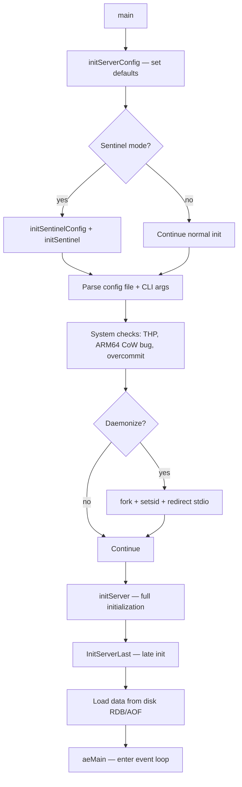
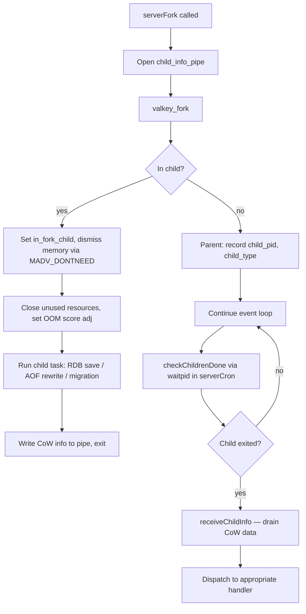
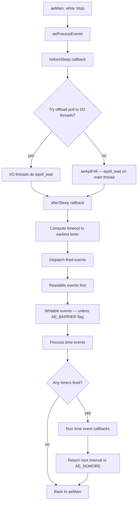
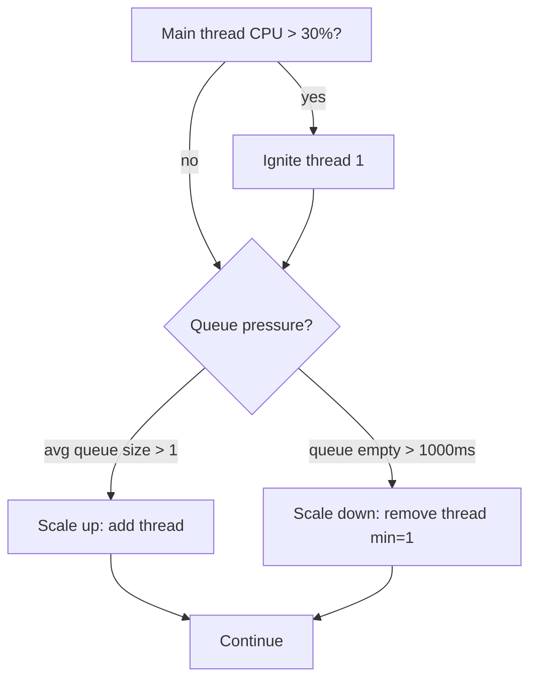
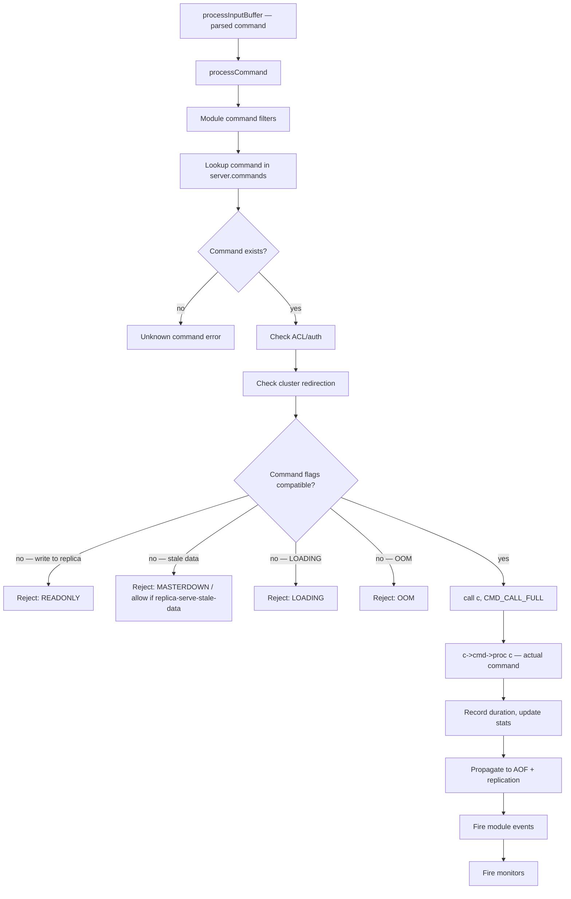
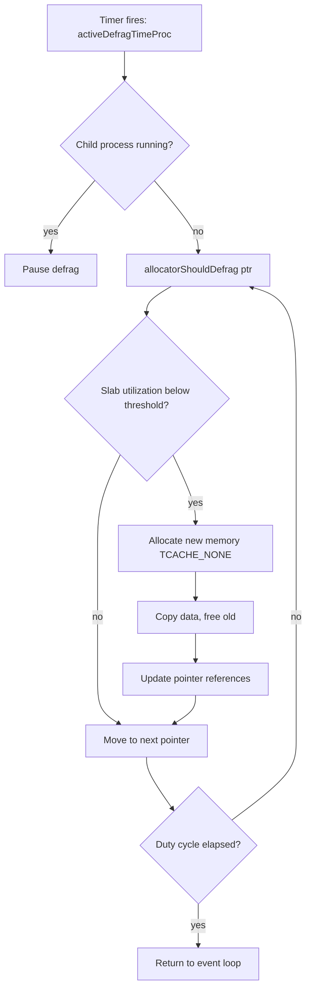
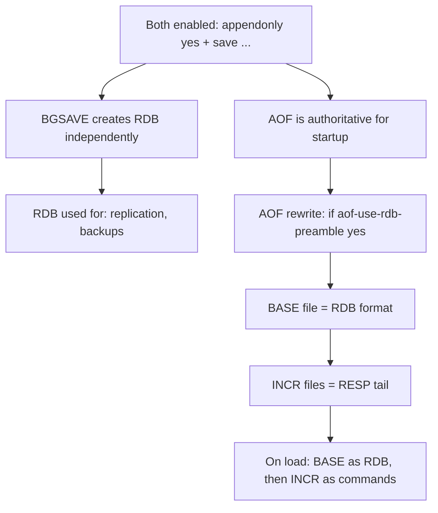

# 01 — Architecture: Processes, Threading, Event Loop, Memory, Persistence

> Based on Valkey 9.1 codebase. Files referenced: `src/server.c`, `src/ae.c`, `src/ae.h`, `src/bio.c`, `src/io_threads.c`, `src/zmalloc.c`, `src/rdb.c`, `src/aof.c`, `src/defrag.c`, `src/evict.c`, `src/lazyfree.c`, `src/object.c`, `src/dict.c`, `src/quicklist.c`, `src/listpack.c`, `src/childinfo.c`.

---

## Table of Contents

1. [Process Lifecycle](#1-process-lifecycle)
2. [Event Loop (ae)](#2-event-loop-ae)
3. [Threading Model](#3-threading-model)
4. [Command Processing Pipeline](#4-command-processing-pipeline)
5. [Memory Management](#5-memory-management)
6. [Persistence Overview](#6-persistence-overview)
7. [Key Configuration Parameters](#7-key-configuration-parameters)

---

## 1. Process Lifecycle

### Startup Sequence



**`initServer()`** (`src/server.c` ~line 2881) does the heavy lifting:

- Signal handlers (SIGHUP, SIGTERM, SIGINT)
- Syslog setup
- Database structures: `server.db[]` array, each with `keys`, `expires`, `keys_with_volatile_items` kvstores
- `createSharedObjects()` — pre-allocated integers 0–10000, protocol strings (`+OK\r\n`, `$-1\r\n`), command names
- `aeCreateEventLoop(server.maxclients + CONFIG_FDSET_INCR)` — creates the event loop
- Time events registered:
  - `serverCron` (100 Hz, 10ms interval) — the heartbeat of the server
  - `clientsTimeProc` (1 Hz) — client housekeeping
- `beforeSleep` / `afterSleep` callbacks set on the event loop
- `initListeners()` — binds TCP, TLS, Unix socket, and RDMA sockets, registers accept handlers

**`InitServerLast()`** handles deferred initialization that requires data structures to already exist — including loading persistence data.

### Shutdown

Signal handlers set `server.shutdown_asap`. The `serverCron` function detects this and calls:

1. `prepareForShutdown()` — saves RDB/AOF if configured, flushes buffers, saves cluster config
2. `finishShutdown()` — closes connections, frees resources
3. `exit(0)`

`SHUTDOWN SAVE` / `SHUTDOWN NOSAVE` / `SHUTDOWN ABORT` control the behavior. `SHUTDOWN SAFE` (9.0+) rejects shutdown when unsafe conditions exist.

### Child Processes

Valkey uses `fork()` for background operations. The `serverFork()` wrapper (`src/server.c` ~line 7060):



**`dismissMemoryInChild()`** — critical optimization: in the child process, calls `madvise(MADV_DONTNEED)` on replication buffers and client buffers. This tells the kernel the child doesn't need those pages, so when the parent modifies them, no copy-on-write copy is needed for the child. Reduces CoW memory significantly. Only effective with THP disabled and jemalloc on Linux.

**Only one mutually-exclusive child at a time** — `hasActiveChildProcess()` prevents concurrent BGSAVE and AOFRW.

---

## 2. Event Loop (ae)

The `ae` event loop is the heartbeat of Valkey. Everything — network I/O, command execution, timers, persistence triggers — flows through it.

### Data Structures (`src/ae.h`)

```c
typedef struct aeEventLoop {
    int maxfd;                  // highest file descriptor registered
    int setsize;                // size of events array
    long long timeEventNextId;
    time_t lastTime;            // for system clock change detection
    aeFileEvent *events;        // registered file events (indexed by fd)
    aeFiredEvent *fired;        // returned from aeApiPoll
    aeTimeEvent *timeEventHead; // linked list of timers
    int stop;                   // flag to exit the loop
    void *apidata;              // OS-specific poll data (epoll fd on Linux)
    aeBeforeSleepProc *beforesleep;
    aeBeforeSleepProc *aftersleep;
    int flags;
    aeCustomPollProc *custompoll; // for I/O thread offloading
    pthread_mutex_t poll_mutex;   // protects poll when offloaded
} aeEventLoop;
```

### Main Loop (`aeMain` → `aeProcessEvents`)



### Before Sleep (`beforeSleep` — `src/server.c` ~line 1812)

Called **before** `aeApiPoll`. Critical for batching and latency optimization:

1. Try offloading poll to I/O threads (`trySendPollJobToIOThreads`)
2. Process I/O thread responses
3. Process TLS pending data
4. Cluster before-sleep (`clusterBeforeSleep`)
5. Handle blocked clients (`blockedBeforeSleep`)
6. Active expire cycle (`activeExpireCycle`)
7. Fire module eventloop events
8. Send ACK to replicas
9. **Flush AOF** (`flushAppendOnlyFile`)
10. **Handle clients with pending writes** (`handleClientsWithPendingWrites`)
11. More I/O responses processing
12. Free async-close clients, trim replication backlog, evict clients
13. Record latency metrics
14. Call `IOThreadsBeforeSleep()`
15. **Release module GIL** — **last action before poll**

### After Sleep (`afterSleep` — `src/server.c` ~line 2014)

Called **after** `aeApiPoll` returns:

1. **Acquire module GIL**
2. Record event loop start time
3. Update cached time (`updateCachedTime`)
4. `IOThreadsAfterSleep(numevents)` — I/O thread scaling logic

### Poll Backends

| OS | Backend |
|----|---------|
| Linux | `epoll` (`src/ae_epoll.c`) |
| macOS/BSD | `kqueue` (`src/ae_kqueue.c`) |
| Solaris | `evport` (`src/ae_evport.c`) |
| Fallback | `select` (`src/ae_select.c`) |

### `serverCron` — The Heartbeat (10 Hz)

Registered as a time event with 100ms initial interval. Key responsibilities:

- Check for terminated child processes (`checkChildrenDone`)
- Update memory stats and check fragmentation
- Active expire cycle for expired keys
- Replica connection management and timeout handling
- Cluster gossip and failover detection (`clusterCron`)
- Replication backlog trimming
- Client eviction (idle clients, query buffer limits)
- Persistence scheduling (trigger BGSAVE if dirty keys exceed threshold)
- AOF fsync scheduling
- Latency sampling
- Module cron callbacks

---

## 3. Threading Model

### Default: Single-Threaded Event Loop

By default, Valkey runs on a **single main thread** handling all network I/O, command execution, and housekeeping. This is the source of its simplicity and predictable latency.

```
┌─────────────────────────────────────────────┐
│              Main Thread                     │
│  ┌───────────┐  ┌───────────┐  ┌──────────┐ │
│  │ aeMain    │→ │ beforeSleep│→ │ aeApiPoll│ │
│  │ (loop)    │  │ (batch)   │  │ (epoll)  │ │
│  └───────────┘  └───────────┘  └──────────┘ │
│       ↓              ↓              ↓        │
│  ┌───────────────────────────────────────┐  │
│  │  Process fired events + time events   │  │
│  └───────────────────────────────────────┘  │
└─────────────────────────────────────────────┘
```

### Background I/O Threads (bio)

5 dedicated background threads for blocking I/O operations:

| Worker Thread | Job Types | Purpose |
|---|---|---|
| `bio_close_file` (worker 0) | `BIO_CLOSE_FILE` | Deferred `close(2)` with optional fsync and page cache reclaim |
| `bio_aof` (worker 1) | `BIO_AOF_FSYNC`, `BIO_CLOSE_AOF` | AOF fsync and AOF file close |
| `bio_lazy_free` (worker 2) | `BIO_LAZY_FREE` | Deferred object freeing (`UNLINK`, `FLUSHDB ASYNC`, async eviction) |
| `bio_rdb_save` (worker 3) | `BIO_RDB_SAVE` | Replica receiving RDB from primary, saving to disk |
| `bio_tls_reload` (worker 4) | `BIO_TLS_RELOAD` | Async TLS configuration reload |

Each worker processes jobs sequentially from a `mutexQueue`. Jobs are submitted by the main thread — the bio threads are purely consumers.

### I/O Thread Offloading (9.1 — Lock-Free Redesign)

Valkey 9.1 completely redesigned I/O threading with lock-free MPSC queues. Can offload:

| Job Type | Description |
|---|---|
| `JOB_REQ_READ_CLIENT` | Offload client read + parse |
| `JOB_REQ_WRITE_CLIENT` | Offload client write (reply) |
| `JOB_REQ_FREE_ARGV` | Offload argv freeing (SPSC to specific thread) |
| `JOB_REQ_FREE_OBJ` | Offload object freeing |
| `JOB_REQ_POLL` | Offload `epoll_wait` itself |
| `JOB_REQ_ACCEPT` | Offload accept/TLS handshake |

**Queue architecture**:

```
                  ┌─────────────────┐
                  │ io_shared_inbox │ ← SPMC (main produces, all consume)
                  │  (read/write/   │
                  │   accept jobs)  │
                  └────────┬────────┘
                           │
         ┌─────────────────┼─────────────────┐
         ↓                 ↓                 ↓
    ┌─────────┐      ┌─────────┐      ┌─────────┐
    │ I/O T 1 │      │ I/O T 2 │      │ I/O T N │
    └────┬────┘      └────┬────┘      └────┬────┘
         │                │                │
         └────────────────┼────────────────┘
                          ↓
                  ┌─────────────────┐
                  │ io_shared_outbox│ → MPSC (all produce, main consumes)
                  │   (results)     │
                  └────────┬────────┘
                           ↓
                    Main Thread
```

**Dynamic scaling** (`IOThreadsAfterSleep`):



**Configuration**: `io-threads` (default 1, range 1–256). Modifiable at runtime via `CONFIG SET`. When `io-threads=1`, offloading is disabled entirely.

**What is NOT offloaded**: Replica clients, blocked clients, Lua debug clients, clients with pending I/O are excluded from offloading. Command execution (`call()`) always runs on the main thread.

### Module GIL

Modules run under a Global Interpreter Lock. The GIL is:
- **Acquired** in `afterSleep` (before processing events)
- **Released** as the **last action** in `beforeSleep` (before `aeApiPoll`)

This means modules execute only while the main thread is processing events — not during I/O polling. Long-running module commands block the entire event loop.

---

## 4. Command Processing Pipeline

### Entry Point: `processCommand()` (`src/server.c` ~line 4269)



### `call()` — Command Execution (`src/server.c` ~line 3829)

The core execution wrapper:

1. Sets `server.executing_client = c`
2. Records start time
3. Calls `c->cmd->proc(c)` — the actual command implementation
4. Records duration, updates command stats
5. Propagates to AOF and replication (if data changed and `CMD_CALL_PROPAGATE` flag)
6. Fires `VALKEYMODULE_EVENT_COMMAND` module event
7. Sends to monitors

### Command Table

Commands are stored in `server.commands` hashtable, populated from `serverCommandTable[]` which is auto-generated from JSON command definitions (`commands.c`). Each command entry includes:

- `declared_name` — primary name
- `arity` — expected argument count (negative = minimum)
- `flags` — write, readonly, deny-oom, deny-stale, loading, etc.
- `proc` — function pointer
- `key_spec` — which arguments are keys

---

## 5. Memory Management

### Allocator Abstraction (`zmalloc`)

Valkey wraps the underlying allocator through `zmalloc`/`zfree`/`zrealloc`/`zcalloc`:

| Supported Allocator | Compile-time Macro |
|---|---|
| jemalloc (recommended) | `USE_JEMALLOC` |
| tcmalloc | `USE_TCMALLOC` |
| libc malloc (default) | Neither macro set |

**Thread-local tracking**: Each thread updates its own slot in `used_memory_thread[]` — avoids lock contention. `zmalloc_used_memory()` sums all thread-local counters.

**OOM handler**: Pluggable via `zmalloc_set_oom_handler()`. Default: print to stderr and abort.

### Memory Tracking

| Metric | How Measured |
|---|---|
| `used_memory` | Sum of `zmalloc` allocations across all threads |
| `used_memory_peak` | High-water mark of `used_memory` |
| RSS | Read from `/proc/self/stat` (field 24, vm_rss) on Linux |
| Fragmentation ratio | `RSS / used_memory` |
| Allocator fragmentation | jemalloc `mallctl` → `(frag_smallbins_bytes / allocated) + 1` |
| RSS overhead | `RSS / allocator_resident` — memory outside allocator control |

### Memory Tracking Diagram

```mermaid
flowchart TD
    A[Application] --> B[zmalloc / zfree]
    B --> C[Thread-local counter update]
    C --> D[used_memory_thread[i]]
    D --> E[zmalloc_used_memory — sum all threads]
    B --> F[Underlying allocator: jemalloc/tcmalloc/libc]
    F --> G[OS pages]
    G --> H[RSS via /proc/self/stat]
    E --> I[Fragmentation = RSS / used_memory]
```

### Data Structures and Encodings

| Type | Encodings | Notes |
|---|---|---|
| STRING | INT, EMBSTR, RAW | EMBSTR for ≤ 44 bytes (single allocation with robj header) |
| LIST | QUICKLIST, LISTPACK | quicklist = linked list of listpack nodes |
| SET | INTSET, HASHTABLE, LISTPACK | intset auto-upgrades (never downgrades) |
| ZSET | LISTPACK, SKIPLIST | skiplist + hashtable for ordered iteration + O(1) lookup |
| HASH | LISTPACK, HASHTABLE | 9.0+: supports field-level expiration (HFE) |
| STREAM | STREAM | rax + listpacks |

### Memory-Efficient Structures

**listpack**: Sequential packed byte array. 6-byte header (4-byte total_len + 2-byte num_elements). Variable-length encoding: 7-bit uint, 13-bit int, 16/24/32/64-bit ints, 6/12/32-bit strings. Backward-length bytes for reverse iteration. Replaced ziplist.

**quicklist**: Doubly-linked list of listpack nodes. Each node (32 bytes) contains a listpack or LZF-compressed data. Configurable `fill` factor and `compress` depth. Supports bookmarks for defrag iteration.

**intset**: Sorted array of integers with uniform encoding (INT16/INT32/INT64). Binary search for lookup. Auto-upgrades encoding when larger values are added.

**sds**: Flexible string library. Multiple header types (3/5/8/16/64-bit length fields) to minimize overhead for different string sizes.

### Shared Objects

Common values are pre-allocated with `refcount = OBJ_SHARED_REFCOUNT`:

- Integers 0–10000 (stored as pointer-cast, zero heap allocation)
- Protocol responses (`+OK\r\n`, `:0\r\n`, `$-1\r\n`)
- Error messages, command names
- Shared NULL for RESP2/RESP3

Shared objects cannot be modified — `tryObjectEncodingEx()` refuses objects with `refcount > 1`.

### Memory Limits and Eviction

When `maxmemory` is set and the limit is reached, Valkey evicts keys based on the configured policy:

| Policy | Scope | Strategy |
|---|---|---|
| `volatile-lru` | Keys with TTL | LRU approximation |
| `volatile-lfu` | Keys with TTL | LFU |
| `volatile-ttl` | Keys with TTL | Shortest TTL first |
| `volatile-random` | Keys with TTL | Random |
| `allkeys-lru` | All keys | LRU approximation |
| `allkeys-lfu` | All keys | LFU |
| `allkeys-random` | All keys | Random |
| `no-eviction` | — | Return OOM errors (default) |

**Eviction process** (`src/evict.c`):

1. `performEvictions()` called before command execution
2. Uses an eviction pool of 16 entries
3. Samples `maxmemory_samples` keys per database
4. Inserts candidates into pool ordered by eviction priority
5. Evicts the best candidate
6. Repeats until memory is under limit or no more candidates

**Not counted toward maxmemory**: Replica output buffers (beyond backlog size), AOF buffer, cluster slot export buffers. This prevents a feedback loop where eviction generates DEL commands that fill buffers, which triggers more eviction.

### Active Defragmentation (jemalloc only)

Active defrag relocates live data to reduce external fragmentation:



**Stages**: Main DB keys → expires → keys with volatile items → pub/sub → Lua scripts → module globals.

**Large objects** (> `active_defrag_max_scan_fields`) are deferred and processed incrementally. Uses bookmarks (e.g., `_AD` for quicklists) to resume.

### Lazy Free — Asynchronous Deletion

Moves expensive deallocations to a background BIO thread:

- **Threshold**: "Free effort" > 64 internal allocations
- **Free effort calculation**: quicklist length, hashtable size, skiplist length, stream PEL size
- **Operations using lazy free**: `UNLINK`, `FLUSHDB ASYNC`, async eviction (when `lazyfree_lazy_eviction yes`), replica flush after receiving RDB

Default in Valkey: all `lazyfree-lazy-*` configs default to `yes` (changed from Redis defaults).

---

## 6. Persistence Overview

Valkey has two persistence mechanisms that can run simultaneously:

| Mechanism | Format | Purpose |
|---|---|---|
| RDB | Binary snapshot | Point-in-time snapshots, replication, backups |
| AOF | Append-only log (RESP commands) | Durability, recovery, audit trail |

### RDB

**File format** (`src/rdb.c`):

```
[9-byte magic "VALKEY080"]
[AUX fields: version, ctime, used-mem, replication info, etc.]
[Module AUX (before)]
[Functions]
[Slot Import (9.0+)]
┌─────────────────────────────────┐
│  For each database:             │
│    SELECTDB + db_number         │
│    RESIZEDB + size hints        │
│    For each key:                │
│      [EXPIRETIME_MS]            │
│      [IDLE (LRU)]               │
│      [FREQ (LFU)]               │
│      TYPE + KEY + VALUE         │
└─────────────────────────────────┘
[Module AUX (after)]
[EOF opcode (255)]
[8-byte CRC64 checksum]
```

**Version**: RDB version 80 (`VALKEY080`). Versions 12–79 are reserved for non-OSS Redis formats and are rejected.

**BGSAVE**: `fork()` → child writes RDB → parent checks `waitpid` → updates stats. Uses `child_info_pipe` for CoW stats and progress reporting.

**Diskless replication**: Primary streams RDB directly to replica sockets via pipe (no intermediate file). Uses `$EOF:<40-byte-marker>` for stream detection.

### AOF

**Multi-part AOF** with manifest:

| File Type | Suffix | Format |
|---|---|---|
| BASE | `.base.rdb` or `.base.aof` | RDB (with preamble) or RESP |
| INCR | `.incr.aof` | RESP commands |
| HIST | (same naming) | Old files pending deletion |

**Manifest example**:
```
file appendonly.aof.2.base.rdb seq 2 type b
file appendonly.aof.1.incr.aof seq 1 type h
file appendonly.aof.2.incr.aof seq 2 type h
file appendonly.aof.3.incr.aof seq 3 type i
```

**AOF rewrite**: `fork()` → child writes new BASE (RDB preamble if `aof-use-rdb-preamble yes`) → parent opens new INCR for incoming writes → on child exit, parent updates manifest, moves old files to HIST, deletes HIST in background via BIO thread.

**fsync policies**:

| Policy | Durability | Performance |
|---|---|---|
| `always` | Every write synced | Slowest |
| `everysec` (default) | Synced every second | Good balance |
| `no` | OS decides | Fastest |

**Loading priority**: AOF has absolute priority when `aof_state == AOF_ON`. RDB is only loaded when AOF is disabled.

### Copy-on-Write

During `fork()`, parent and child share all memory pages. When the parent modifies a shared page (due to write commands), the kernel copies that page before the parent writes.

**Tracking**: `zmalloc_get_private_dirty()` reads `/proc/self/smaps` to get "Private_Dirty" — pages modified since fork.

**Mitigation**: `dismissMemoryInChild()` calls `madvise(MADV_DONTNEED)` on buffers in the child process. Only effective with THP disabled and jemalloc on Linux.

**Impact**: CoW memory = RSS spike during BGSAVE/AOFRW. With heavy write load during persistence, CoW can approach the full memory footprint.

### RDB and AOF Interaction



---

## 7. Key Configuration Parameters

### Threading

| Parameter | Default | Description |
|---|---|---|
| `io-threads` | 1 | Number of I/O threads (1 = disabled). Range: 1–256. Runtime modifiable. |
| `bio_cpulist` | (empty) | CPU affinity mask for bio threads |
| `server_cpulist` | (empty) | CPU affinity mask for main thread |

### Memory

| Parameter | Default | Description |
|---|---|---|
| `maxmemory` | 0 (unlimited) | Maximum memory limit |
| `maxmemory-policy` | noeviction | Eviction policy |
| `maxmemory-samples` | 5 | Sample size for LRU/LFU approximation |
| `active-defrag-enabled` | no | Enable active defragmentation (jemalloc only) |
| `active-defrag-cycle-us` | varies | Defrag duty cycle in microseconds |
| `active-defrag-cpu-percent` | varies | Target CPU usage for defrag |
| `lazyfree-lazy-eviction` | yes | Async eviction |
| `lazyfree-lazy-expire` | yes | Async key expiration |
| `lazyfree-lazy-server-del` | yes | Async server-initiated deletion |
| `lazyfree-lazy-user-del` | yes | Async DEL/UNLINK |
| `lazyfree-lazy-user-flush` | yes | Async FLUSHDB/FLUSHALL |

### Persistence

| Parameter | Default | Description |
|---|---|---|
| `save` | multiple rules | RDB save triggers (e.g., `save 3600 1`) |
| `appendonly` | no | Enable AOF |
| `appendfsync` | everysec | AOF fsync policy |
| `no-appendfsync-on-rewrite` | no | Skip fsync during BGSAVE/AOFRW |
| `aof-use-rdb-preamble` | yes | Use RDB format for AOF BASE |
| `aof-load-truncated` | yes | Accept truncated AOF files |
| `rdb-checksum` | yes | CRC64 checksum for RDB |
| `rdb-save-incremental-fsync` | yes | Incremental fsync during RDB save |

### System

| Parameter | Default | Description |
|---|---|---|
| `hz` | 10 | serverCron frequency (1–500) |
| `maxclients` | 10000 | Max simultaneous connections |
| `tcp-backlog` | 511 | TCP listen backlog |
| `timeout` | 0 | Close idle connections after N seconds (0 = disabled) |
