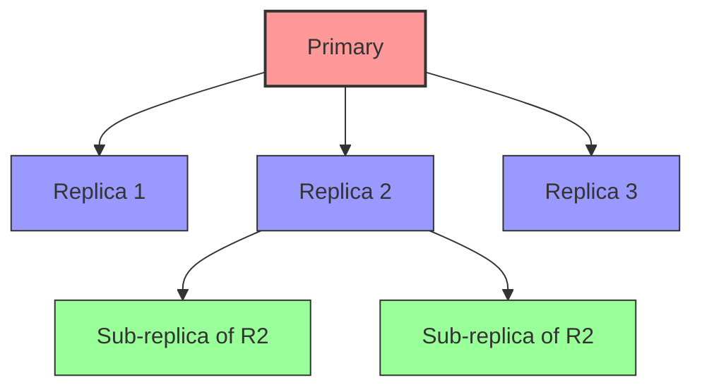
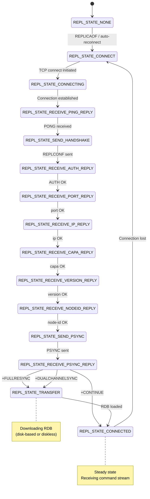
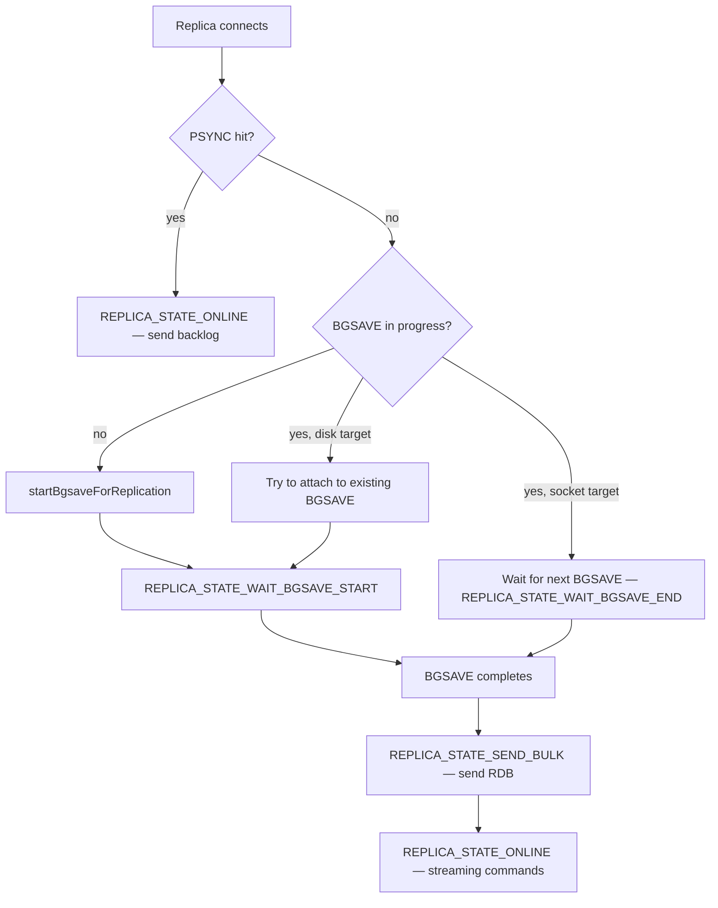
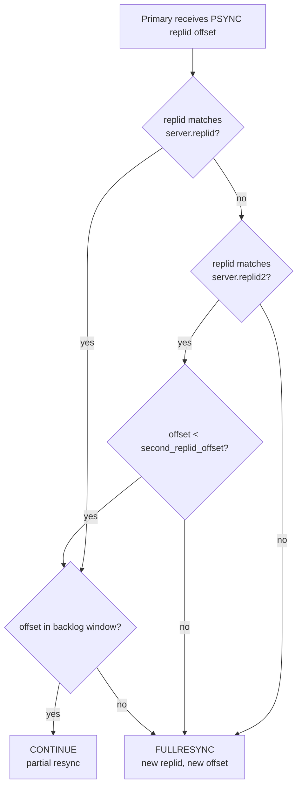
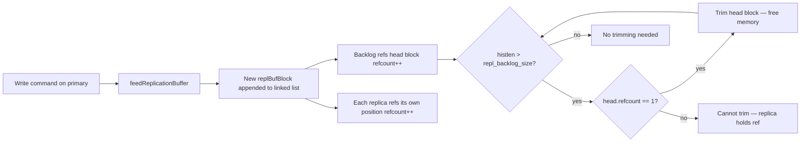
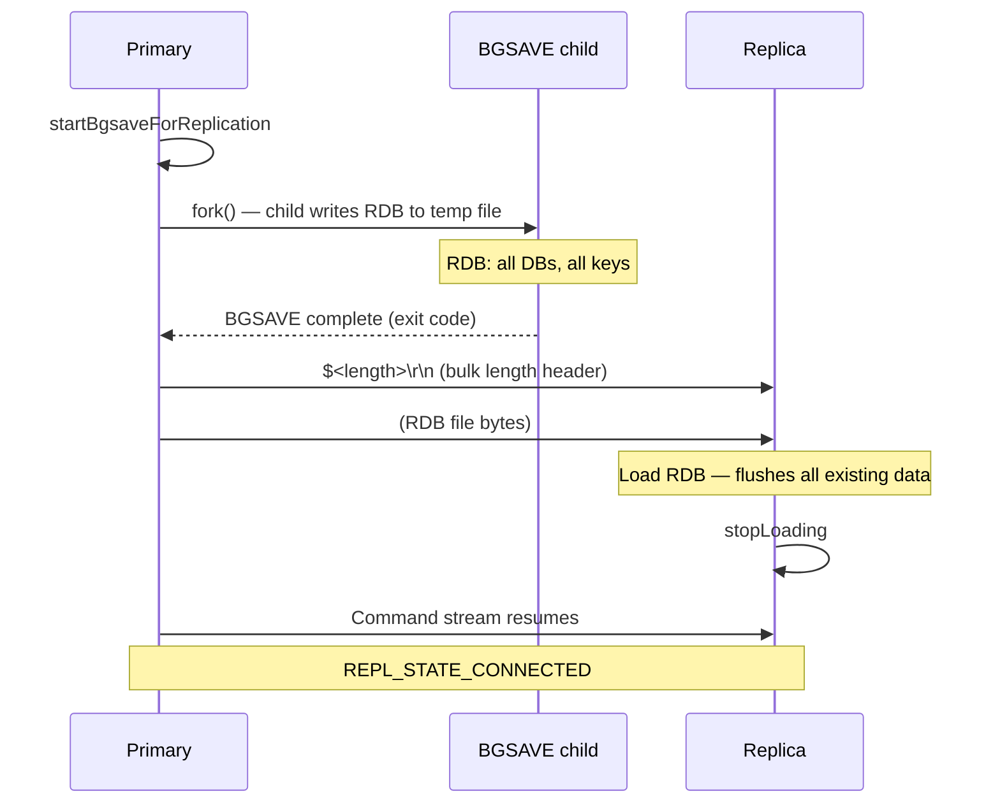
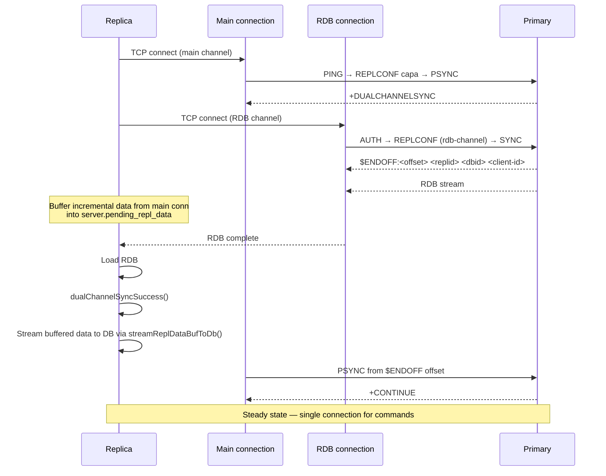
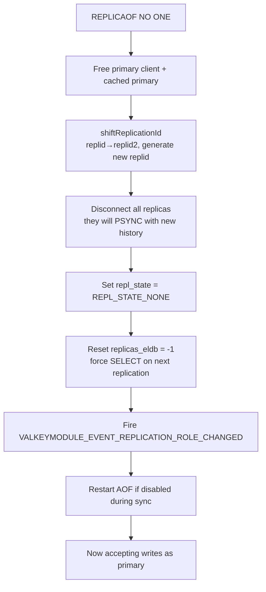
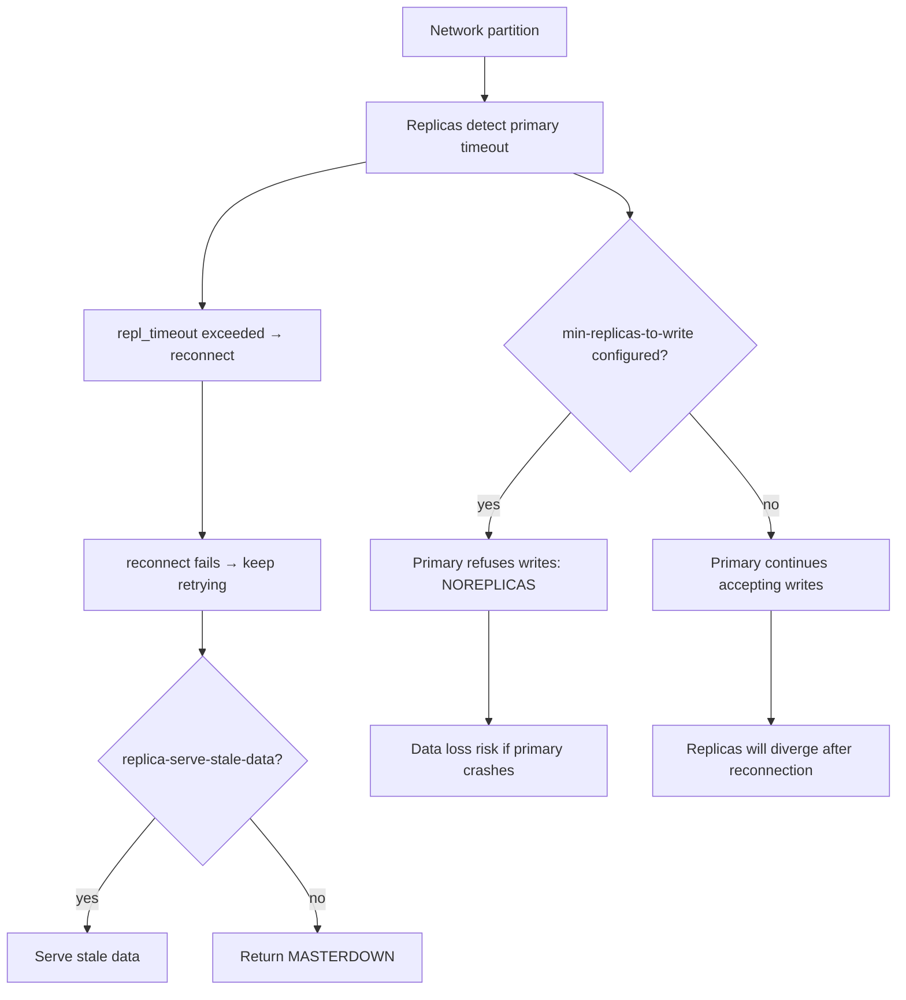
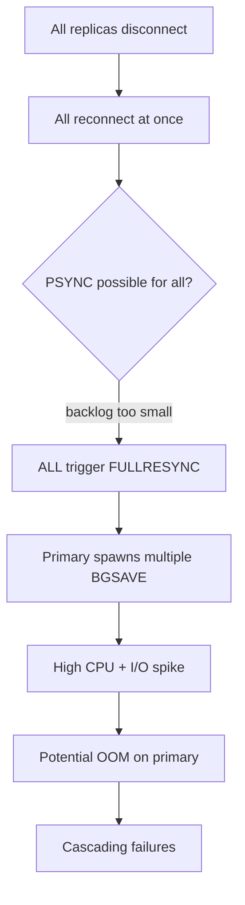

# 02 — Replication

> Based on Valkey 9.1 codebase. Primary source: `src/replication.c` (~5757 lines), `src/server.h` structures.

---

## Table of Contents

1. [Replication Model](#1-replication-model)
2. [State Machines](#2-state-machines)
3. [PSYNC Protocol](#3-psync-protocol)
4. [Replication Backlog](#4-replication-backlog)
5. [Full Resynchronization](#5-full-resynchronization)
6. [Diskless Replication](#6-diskless-replication)
7. [Dual-Channel Replication](#7-dual-channel-replication)
8. [RDB Save in Bio Thread](#8-rdb-save-in-bio-thread)
9. [Replica Promotion & Failover](#9-replica-promotion--failover)
10. [Chained Replication](#10-chained-replication)
11. [Replication and AOF](#11-replication-and-aof)
12. [Failure Scenarios](#12-failure-scenarios)
13. [Configuration Reference](#13-configuration-reference)

---

## 1. Replication Model

Valkey uses **single-primary, multi-replica** replication. The primary handles all writes; replicas receive a stream of write commands and apply them asynchronously.

### Key Properties

- **Asynchronous**: Replicas do not block the primary. Write acknowledgment is sent to the client before the replica applies the command.
- **Stream-based**: After initial sync, the primary sends a continuous stream of write commands in RESP format.
- **Shared backlog**: All replicas share a single replication backlog buffer on the primary, enabling partial resynchronization.
- **Replication ID**: Each primary has a unique 40-character hex replication ID (`replid`). When a replica becomes a primary, it inherits the old ID as `replid2` and generates a new `replid`.

### Replication Topology



### Data Flow

```
Primary                        Replica
   │                              │
   │  Write command (SET key val) │
   │  ↓                           │
   │  Apply to local DB           │
   │  ↓                           │
   │  feedReplicationBuffer()     │
   │  ↓                           │
   │  Append to backlog           │
   │  ↓                           │
   │  Write to replica sockets    │──────→  Read by replica
   │                              │         ↓
   │                              │   processInputBuffer()
   │                              │   ↓
   │                              │   Execute command locally
```

---

## 2. State Machines

### Replica State Machine (replica → primary)

The replica transitions through these states during connection and synchronization:



### Primary-Side Replica States

The primary tracks each connected replica through these states:

| State | Value | Meaning |
|---|---|---|
| `REPLICA_STATE_WAIT_BGSAVE_START` | 6 | Need to produce a new RDB file |
| `REPLICA_STATE_WAIT_BGSAVE_END` | 7 | Waiting for BGSAVE to finish |
| `REPLICA_STATE_SEND_BULK` | 8 | Sending RDB file to replica |
| `REPLICA_STATE_ONLINE` | 9 | RDB transmitted, sending command updates |
| `REPLICA_STATE_RDB_TRANSMITTED` | 10 | RDB-only replica (no replication buffer needed) |
| `REPLICA_STATE_BG_RDB_LOAD` | 11 | Dual-channel replication main channel |

### Primary-Side State Flow



---

## 3. PSYNC Protocol

PSYNC (partial resynchronization) is the mechanism that allows replicas to reconnect without a full RDB transfer.

### The PSYNC Command

```
PSYNC <replid> <offset>
```

The replica sends its known replication ID and offset. The primary decides:

### Decision Logic



### Responses

| Response | Meaning |
|---|---|
| `+CONTINUE <replid>` | Partial resync accepted. Primary sends backlog data from requested offset. |
| `+FULLRESYNC <replid> <offset>` | Full resync required. Replica must load a new RDB. |
| `+DUALCHANNELSYNC` | Full sync with dual-channel mode. Replica creates a second connection for RDB. |
| `-NOMASTERLINK` | Primary cannot provide RDB (transient) |
| `-LOADING` | Primary is still loading data at startup |

### Replication ID Inheritance

When a replica is promoted to primary (via `REPLICAOF NO ONE` or cluster failover):

```c
// In shiftReplicationId():
server.replid2 = server.replid;                    // old ID preserved
server.second_replid_offset = server.primary_repl_offset;  // cut-off point
server.replid = generateNewReplid();               // new ID generated
```

This is critical: sub-replicas of the newly-promoted primary can still PSYNC successfully because they know the old `replid`, which is now stored in `server.replid2`.

### Cached Primary for PSYNC

When the primary connection drops, the replica **caches** the primary client instead of freeing it:

```
replicationCachePrimary() → saves server.cached_primary with preserved offset and ID
  → On reconnection: replicationResurrectCachedPrimary() restores the connection
  → If PSYNC fails: replicationDiscardCachedPrimary() frees the cached client
```

This allows immediate PSYNC attempt on reconnection without losing replication context.

### When a Primary Becomes a Replica

```c
// replicationCachePrimaryUsingMyself()
// When a primary becomes a replica, it caches itself using its own parameters.
// This allows it to PSYNC with the new primary if they share history.
server.primary_initial_offset = server.primary_repl_offset;
```

---

## 4. Replication Backlog

The replication backlog is a **shared circular buffer** that stores the replication stream. It is the key enabler of PSYNC.

### Data Structures

```c
typedef struct replBacklog {
    rax *blocks_index;              // rax tree: offset → block (fast lookup)
    replBufBlock *ref_repl_buf_node; // first block referenced by backlog
    long long histlen;              // actual data length
    long long offset;               // primary offset of first byte in backlog
    long long unindexed_count;      // blocks since last index entry
} replBacklog;

typedef struct replBufBlock {
    int refcount;                   // # replicas + backlog referencing this block
    long long id;                   // unique incremental ID
    long long repl_offset;          // start replication offset
    size_t size, used;              // buffer dimensions
    char buf[];                     // actual data
} replBufBlock;
```

### How It Works



### Critical Safety Property

**The backlog can grow beyond `repl-backlog-size`** if a slow replica holds references to old blocks. Trimming is blocked while any replica's `refcount > 1` on the head block.

This is intentional: disconnecting a slow replica to preserve backlog size would cause a full resync for that replica, which is often more expensive than the extra memory.

### Indexing for Fast Lookup

Every `REPL_BACKLOG_INDEX_PER_BLOCKS` (16) blocks, an entry is added to the rax tree. This allows O(log n) offset search during partial resync:

```c
// In addReplyReplicationBacklog():
// 1. Use rax index to find approximate block
// 2. Walk the list to find exact byte position
// 3. Set up replica's output buffer from that position
```

### Backlog Lifecycle

| Event | Behavior |
|---|---|
| First replica connects | `createReplicationBacklog()` — allocates backlog + new replid |
| Write command | `feedReplicationBuffer()` — appends data to buffer |
| Periodic (every block) | `incrementalTrimReplicationBacklog()` — trims old blocks if safe |
| No replicas for `repl-backlog-time-limit` seconds | `freeReplicationBacklog()` — frees backlog, changes replid |
| Replica PSYNCs | `addReplyReplicationBacklog()` — uses rax index to find offset |

### Block Size Limit

Each block is capped at `repl_backlog_size / 16` to prevent huge untrimmable blocks. This limits the damage when a single large command holds back trimming.

---

## 5. Full Resynchronization

Triggered when PSYNC fails (backlog miss, first sync, replication ID mismatch).

### Three Cases on the Primary

| Case | Condition | Behavior |
|---|---|---|
| CASE 1 | No BGSAVE in progress | Call `startBgsaveForReplication()` immediately |
| CASE 2 | BGSAVE in progress with **disk** target | Try to attach replica to existing BGSAVE |
| CASE 3 | BGSAVE in progress with **socket** target | Must wait — set replica to `REPLICA_STATE_WAIT_BGSAVE_END` |

### Disk-Based Full Sync



### Replica Behavior on RDB Load

When receiving an RDB file:

1. Flushes all existing database content (unless diskless SWAPDB mode)
2. Creates a loading context
3. Parses the RDB binary stream
4. Reconstructs all key-value pairs, expirations, LRU/LFU metadata
5. Calls `stopLoading` to resume normal operation

**8.0+ improvement**: Replicas now flush old data *after* checking RDB file is valid, preventing partial data loss on corrupt RDB.

---

## 6. Diskless Replication

### Primary Side (`repl-diskless-sync yes`)

No intermediate file — RDB streams directly from BGSAVE child to replica sockets via pipe.

```mermaid
sequenceDiagram
    participant P as Primary
    participant B as RDB child
    participant R1 as Replica 1
    participant R2 as Replica 2

    P->>B: fork() — child writes RDB to pipe
    B->>P: RDB stream via pipe (parent reads)
    Note over P: Wait repl_diskless_sync_delay seconds<br/>to collect more replicas
    P->>R1: Write RDB stream to socket
    P->>R2: Write RDB stream to socket (same data, fan-out)
    Note over R1,R2: EOF marker detected: $EOF:<40 random bytes>
    Note over R1,R2: Load RDB into memory
    P->>R1,R2: Command stream resumes
```

### Diskless Load Modes (Replica Side)

Controlled by `repl-diskless-load`:

| Mode | Behavior | Downtime |
|---|---|---|
| `disabled` (default) | Don't use diskless load on replica side | Full flush during load |
| `swapdb` | Load RDB into temp DB, atomic swap when done | **Zero** — serves old data during load |
| `flush-before-load` | Flush existing DB, then load | Full flush |
| `when-db-empty` | Only use diskless if DB is empty | Full flush |

**SWAPDB mode** is the most interesting:
- Creates a temporary database array (`disklessLoadInitTempDb()`)
- Loads RDB into temp DB while serving reads from current DB
- On success, atomically swaps with `swapMainDbWithTempDb()`
- Fires `VALKEYMODULE_EVENT_REPL_ASYNC_LOAD` events for modules
- Only enabled when replication IDs match (same data history)

### Delay Configuration

| Parameter | Purpose |
|---|---|
| `repl-diskless-sync-delay` | Seconds to wait for more replicas before starting RDB stream |
| `repl-diskless-sync-max-replicas` | Start immediately if this many replicas are waiting (overrides delay) |

---

## 7. Dual-Channel Replication

An advanced mode (stabilized in 9.0) where **RDB transfer and command stream use separate TCP connections**. Requires `REPLICA_CAPA_DUAL_CHANNEL` on both sides.

### Full Flow



### Why Dual-Channel?

During a full sync with disk-based replication, the primary must pause the command stream for each replica while sending the RDB. With dual-channel:
- RDB arrives on a separate connection
- The main connection continues receiving and buffering the command stream
- After RDB load, buffered data is replayed
- Total sync time is reduced, especially for large datasets

---

## 8. RDB Save in Bio Thread

**New in Valkey 9.1**: On replicas, the RDB file is written to disk using a background I/O thread (`bio_rdb_save` worker) instead of the main process. This reduces main thread blocking during disk-based full sync.

```
Replica receives RDB stream from primary
    ↓
bio_rdb_save thread writes to temp-<timestamp>.<pid>.rdb
    ↓
Main thread continues serving requests (if replica-serve-stale-data)
    ↓
Bio thread signals completion
    ↓
Main thread loads RDB from disk
```

The bio thread periodically fsyncs every `REPL_MAX_WRITTEN_BEFORE_FSYNC` (32KB) bytes.

---

## 9. Replica Promotion & Failover

### REPLICAOF NO ONE

Converts a replica into a standalone primary:



### Coordinated Failover (FAILOVER command)

```
FAILOVER [TO <ip> <port>] [TAKEOVER] [ABORT] [TIMEOUT <ms>]
```

State machine: `FAILOVER_WAIT_FOR_SYNC` → `FAILOVER_IN_PROGRESS` → `COMPLETE`

1. Primary sends `PSYNC <replid> <offset> FAILOVER` to target replica
2. Primary pauses writes
3. Primary waits until replica catches up (`repl_ack_off == primary_repl_offset`)
4. Primary initiates role swap — becomes replica of target
5. Target promotes itself to primary

| Flag | Behavior |
|---|---|
| (none) | Coordinated — primary waits for replica sync, zero data loss |
| `TAKEOVER` | Replica promotes immediately without primary coordination |
| `ABORT` | Cancel an in-progress failover |
| `TIMEOUT` | Max time to wait for coordinated sync |

### min-replicas-to-write

Primary refuses writes if fewer than `min-replicas-to-write` replicas are connected with lag ≤ `min-replicas-max-lag`:

```
(error) NOREPLICAS Not enough good replicas to write.
```

Only applies to primary, not replicas. Useful for data safety: if the primary loses all replica connections, it stops accepting writes to prevent data loss.

---

## 10. Chained Replication

A replica can have its own replicas (sub-replicas). The replication stream is proxied:

```
Primary → Replica → Sub-replica 1
                  → Sub-replica 2
```

### Key Behavior

- The replica proxies the replication stream via `replicationFeedStreamFromPrimaryStream()`
- The replica uses a **private query buffer** for the primary client (not shared) to preserve data for sub-replicas
- When a replica is promoted, `replicationAttachToNewPrimary()` **disconnects all sub-replicas and frees the backlog** — sub-replicas must reconnect and will likely need a full resync

### Sub-Replica Orphan Detection

If a replica detects that its primary is itself a replica of a grand-primary (chain detection), it attempts to connect directly to the grand-primary to fix the chain.

---

## 11. Replication and AOF

### Interaction

- **AOF is not sent to replicas**. Replicas receive the replication stream (RESP commands) which contains the same data.
- **Primary continues writing to AOF** during RDB generation for replicas.
- **After RDB transfer**, the replica receives accumulated commands from the replication backlog.
- **Replica restarts AOF** after successful sync via `restartAOFAfterSYNC()` — retries up to 10 times. If all retries fail, the replica exits with a fatal error.

### AOF Preamble from Replication RDB

**9.1 improvement**: After a disk-based full sync, the replica can **reuse the received RDB file as an AOF base preamble** (if `aof-use-rdb-preamble` is enabled). This avoids generating a separate RDB for the AOF base.

---

## 12. Failure Scenarios

### 12.1 Backlog Overflow → Full Resync

**Symptom**: Replica falls behind, PSYNC offset outside backlog window.

```
Primary backlog: offset=1000000, histlen=500000 → valid range [1000000, 1500000]
Replica PSYNC: offset=800000 → OUTSIDE → FULLRESYNC
```

**Impact**: Full RDB transfer, high memory usage during BGSAVE + RDB transfer, replica serves stale data.

**Mitigation**: Increase `repl-backlog-size`, monitor `repl_backlog_histlen`.

### 12.2 Slow Replica Holding Backlog References

**Symptom**: Backlog grows beyond configured size because a slow replica holds references.

```
repl_backlog_size = 64MB
actual histlen    = 128MB  ← slow replica holds refs
```

**Root cause**: `incrementalTrimReplicationBacklog()` skips blocks with `refcount > 1`.

**Mitigation**: Monitor `client-output-buffer-limit replica`, disconnect chronically slow replicas.

### 12.3 Network Partition



### 12.4 Primary Crash During BGSAVE

**Outcome**:
- Replica detects connection drop → `replicationHandlePrimaryDisconnection()`
- Caches primary client for PSYNC attempt
- If primary restarts: reconnect → PSYNC attempt
- If PSYNC fails (new replid): full resync from scratch

**Risk**: Partially-transmitted RDB is lost. Replica must start over.

### 12.5 Replication Storm After Mass Reconnect

**Scenario**: All replicas lose connection simultaneously (e.g., network switch restart).



**Mitigation**: Size backlog to handle expected disconnection windows.

### 12.6 Expired Key Replication Inconsistency

**Scenario**: Primary replicates `INCR` on an expired key. The key is lazily expired on the primary but the DEL is not propagated.

**Result**: Replica keeps the expired key with old value until accessed. By design.

### 12.7 Output Buffer Limit During PSYNC

**Special case**: During PSYNC, the replica is **NOT closed** for exceeding output buffer limits — even if the buffer exceeds the hard limit. Soft limit timer is also suspended. This allows partial resync to complete.

### 12.8 AOF Restart Failure After Sync

**Behavior**: `restartAOFAfterSYNC()` retries up to 10 times. If all fail → **replica exits with fatal error**.

---

## 13. Configuration Reference

### Core Replication

| Parameter | Default | Description |
|---|---|---|
| `replica-serve-stale-data` | yes | Serve stale data during sync. Set to `no` if stale reads are unacceptable. |
| `replica-read-only` | yes | Replicas reject write commands |
| `repl-diskless-sync` | no | Stream RDB directly to replicas (no temp file) |
| `repl-diskless-sync-delay` | 5 | Seconds to wait for replicas before starting diskless sync |
| `repl-diskless-load` | disabled | Replica-side diskless load mode (`swapdb` recommended) |
| `dual-channel-replication-enabled` | auto | Enable dual-channel full sync |
| `repl-timeout` | 60 | Replication timeout in seconds |
| `repl-backlog-size` | 1MB | Replication backlog size. **Increase to 64–256MB for production.** |
| `repl-backlog-time-limit` | 3600 | Free backlog after N seconds with no replicas |
| `repl-diskless-sync-max-replicas` | 0 | Start diskless sync immediately if this many replicas wait |

### Write Safety

| Parameter | Default | Description |
|---|---|---|
| `min-replicas-to-write` | 0 | Minimum connected replicas to accept writes |
| `min-replicas-max-lag` | 10 | Max acceptable replica lag in seconds |

### Buffer Limits

| Parameter | Default | Description |
|---|---|---|
| `client-output-buffer-limit replica` | 256MB/64MB/60s | Hard limit / soft limit / soft seconds for replica buffers |
