# 03 — Clustering & Sharding

> Based on Valkey 9.1 codebase. Sources: `src/cluster.c`, `src/cluster.h`, `src/cluster_legacy.c` (~8514 lines), `src/cluster_legacy.h`, `src/cluster_migrateslots.c`, `src/crc16.c`.

---

## Table of Contents

1. [Cluster Architecture](#1-cluster-architecture)
2. [Hash Slots & Key Distribution](#2-hash-slots--key-distribution)
3. [Cluster Bus & Gossip Protocol](#3-cluster-bus--gossip-protocol)
4. [Node States & Failure Detection](#4-node-states--failure-detection)
5. [Slot Migration & Resharding](#5-slot-migration--resharding)
6. [Atomic Slot Migration (9.0+)](#6-atomic-slot-migration-90)
7. [Client Redirects](#7-client-redirects)
8. [Cluster Failover](#8-cluster-failover)
9. [Cluster Configuration](#9-cluster-configuration)
10. [Multi-Database Cluster Mode (9.0+)](#10-multi-database-cluster-mode-90)
11. [Replica Migration](#11-replica-migration)
12. [Failure Scenarios](#12-failure-scenarios)
13. [Configuration Reference](#13-configuration-reference)

---

## 1. Cluster Architecture

Valkey Cluster provides **automatic sharding** across multiple nodes using a hash-slot partitioning scheme. Each node owns a subset of 16384 hash slots, and keys are distributed based on their slot assignment.

### Topology

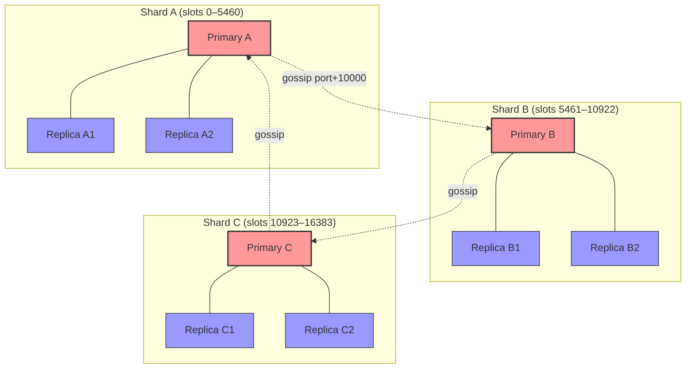

### Two Networks Per Node

| Network | Port | Purpose |
|---|---|---|
| Client port | Configured (e.g., 6379) | Client connections, command processing |
| Cluster bus port | Client port + 10000 (`CLUSTER_PORT_INCR`) | Node-to-node gossip, failover, slot coordination |

### Cluster State

Each node maintains a `clusterState` structure with:

- `slots[16384]` — which node owns each slot
- `nodes` — hash table of all known nodes
- `migrating_slots_to` — slots this node is migrating away (source side)
- `importing_slots_from` — slots this node is importing (destination side)
- `state` — `CLUSTER_OK` or `CLUSTER_FAIL`

---

## 2. Hash Slots & Key Distribution

### Slot Assignment

- **16384 hash slots** (2^14), defined as `CLUSTER_SLOTS`
- Slot = `CRC16(key) & 0x3FFF` (14-bit mask)
- CRC16 uses XMODEM polynomial (0x1021) per CCITT standards

```c
unsigned int keyHashSlot(const char *key, size_t keylen) {
    // ... handle hash tags {..} ...
    return crc16(key, keylen) & 0x3FFF;
}
```

### Hash Tags

Keys with `{...}` hash only the content between braces, enabling co-location:

```
{user:1000}:name     → same slot as {user:1000}:profile
{user:1000}:profile  → same slot as {user:1000}:posts
{user:1000}:posts    → same slot — enables multi-key ops
```

This enables **multi-key operations** (SUNION, MGET, SINTER, etc.) on related keys, as long as all keys hash to the same slot.

### Typical Distribution (3 Primaries)

```
┌─────────────────┬──────────────────┬──────────────────┐
│  Primary A      │  Primary B       │  Primary C       │
│  Slots 0–5460   │  Slots 5461–10922│  Slots 10923–16383│
│  (5461 slots)   │  (5462 slots)    │  (5461 slots)    │
└─────────────────┴──────────────────┴──────────────────┘
```

### Slot Coverage Verification

On startup, `verifyClusterConfigWithData()` checks that all keys in memory belong to slots owned by this node. Keys in unowned slots are deleted — this prevents data inconsistency after topology changes.

---

## 3. Cluster Bus & Gossip Protocol

Nodes communicate over the **cluster bus** (separate TCP port = client_port + 10000).

### Message Types

| Type | Purpose |
|---|---|
| `PING` | Periodic heartbeat |
| `PONG` | Reply to ping |
| `MEET` | Introduce new nodes |
| `FAIL` | Broadcast node failure |
| `PUBLISH` | Pub/sub propagation |
| `FAILOVER_AUTH_REQUEST` | Vote request for failover |
| `FAILOVER_AUTH_ACK` | Vote granted |
| `UPDATE` | Slot configuration update |
| `MFSTART` | Manual failover start |
| `PUBLISHSHARD` | Sharded pub/sub |
| `MODULE` | Module-specific messages |

### Gossip Cycle (`clusterCron` — runs 10x/second)

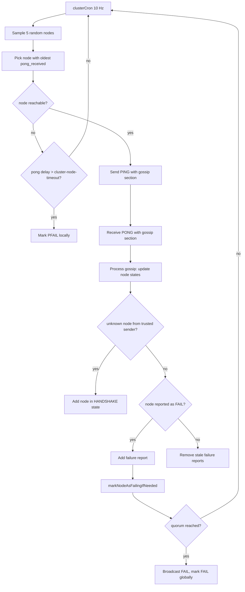

### Gossip Section

Each PING/PONG message contains a **gossip section** with status of randomly selected nodes. This is how failure reports and new node information propagate through the cluster.

### Handshake

`CLUSTER MEET <ip> <port>` initiates `clusterStartHandshake()` — creates a node in `HANDSHAKE` state. If no response within timeout, the handshake node is removed.

---

## 4. Node States & Failure Detection

### Node Flags

| Flag | Meaning |
|---|---|
| `CLUSTER_NODE_PRIMARY` | Node is a primary |
| `CLUSTER_NODE_REPLICA` | Node is a replica |
| `CLUSTER_NODE_PFAIL` | **P**ossibly **FAIL** — local timeout detection |
| `CLUSTER_NODE_FAIL` | Confirmed FAIL — quorum reached |
| `CLUSTER_NODE_HANDSHAKE` | Initial connection phase |
| `CLUSTER_NODE_MIGRATE_TO` | Eligible for replica migration |
| `CLUSTER_NODE_NOFAILOVER` | Replica will not failover |
| `CLUSTER_NODE_NOADDR` | Unknown address |

### PFAIL → FAIL Transition

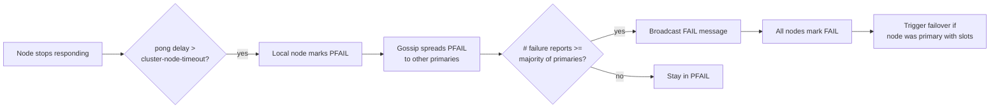

**Quorum formula**: `needed_quorum = (number_of_voting_primaries / 2) + 1`

### FAIL Reversal (`clearNodeFailureIfNeeded`)

| Node Type | Behavior |
|---|---|
| Replica or primary **without** slots | FAIL cleared immediately when node reachable again |
| Primary **with** slots | FAIL cleared only after `CLUSTER_FAIL_UNDO_TIME_MULT` (2x timeout) AND nobody claimed their slots |

This delay prevents a flapping primary from disrupting the cluster: if its slots have already been claimed by a failover, the old primary must not reclaim them.

### Cluster State Evaluation (`clusterUpdateState`)

The cluster enters `CLUSTER_FAIL` state when:

1. **Not full coverage** (`cluster-require-full-coverage yes`): Any slot is unassigned or owned by a FAIL node
2. **Minority partition**: `reachable_primaries < (cluster_size / 2) + 1`

In `CLUSTER_FAIL` state, the node stops accepting writes and returns `CLUSTERDOWN` errors.

---

## 5. Slot Migration & Resharding

### Traditional Migration (Step-by-Step)

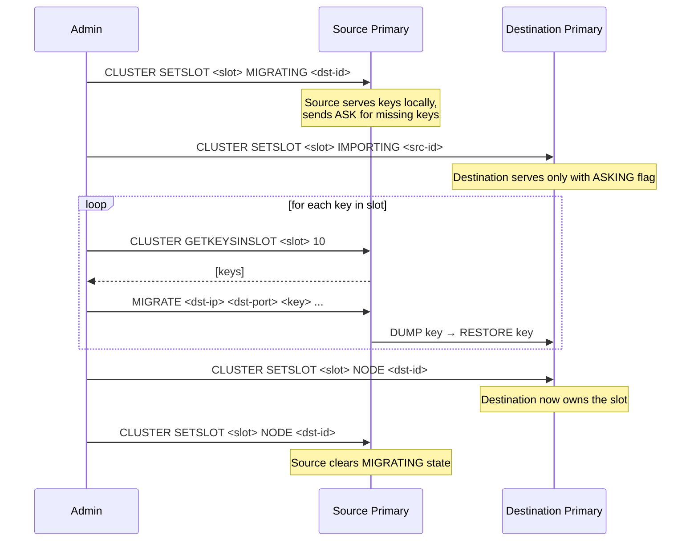

### Migration States

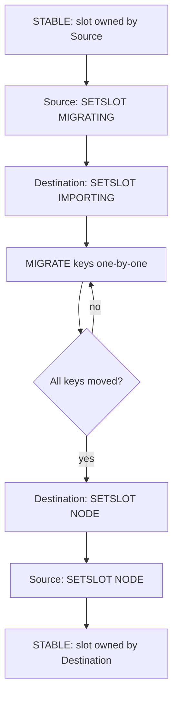

### Behavior During Migration

| Node | State | Behavior |
|---|---|---|
| Source | `MIGRATING` | Serves keys that exist locally, sends `ASK` redirect for missing keys |
| Destination | `IMPORTING` | Serves keys only from clients with `ASKING` flag set |

### SETSLOT Subcommands

| Subcommand | Who Can Execute | Effect |
|---|---|---|
| `SETSLOT <slot> MIGRATING <id>` | Current slot owner only | Mark slot as migrating to destination |
| `SETSLOT <slot> IMPORTING <id>` | Non-owner only | Mark slot as importing from source |
| `SETSLOT <slot> NODE <id>` | Any node | Finalize ownership — assign slot to node |
| `SETSLOT <slot> STABLE` | Any node | Clear migration state |

---

## 6. Atomic Slot Migration (9.0+)

A newer mechanism with a formal state machine that persists in RDB. Uses a child snapshot process to stream data atomically.

### Export State Machine (Source)

```
CONNECTING → SEND_AUTH → SNAPSHOTTING → STREAMING → FAILOVER_PAUSED → FAILOVER_GRANTED
```

### Import State Machine (Destination)

```
WAIT_ACK → RECEIVE_SNAPSHOT → WAITING_FOR_PAUSED → FAILOVER_REQUESTED → FAILOVER_GRANTED → SUCCESS
```

### Protocol

Uses `CLUSTER SYNCSLOTS ESTABLISH/ACK/SNAPSHOT-EOF/PAUSED/FAILOVER-GRANTED` commands and persists via `RDB_OPCODE_SLOT_IMPORT` in the RDB file.

### Module Opt-In

Modules must explicitly opt-in via `ValkeyModule_SetModuleOptions(ctx, VALKEYMODULE_OPTIONS_HANDLE_ATOMIC_SLOT_MIGRATION)`. If a module doesn't opt in, ASM is disabled for the cluster.

---

## 7. Client Redirects

### MOVED — Permanent Redirect

```
-MOVED <slot> <ip>:<port>
```

Returned when a key's slot is owned by a different node. **Client must update its slot map and retry.**

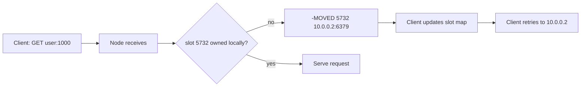

### ASK — Temporary Redirect (during migration)

```
-ASK <slot> <ip>:<port>
```

Returned when slot is `MIGRATING` and key doesn't exist on source (already migrated). Client must send `ASKING` before the actual command on target.

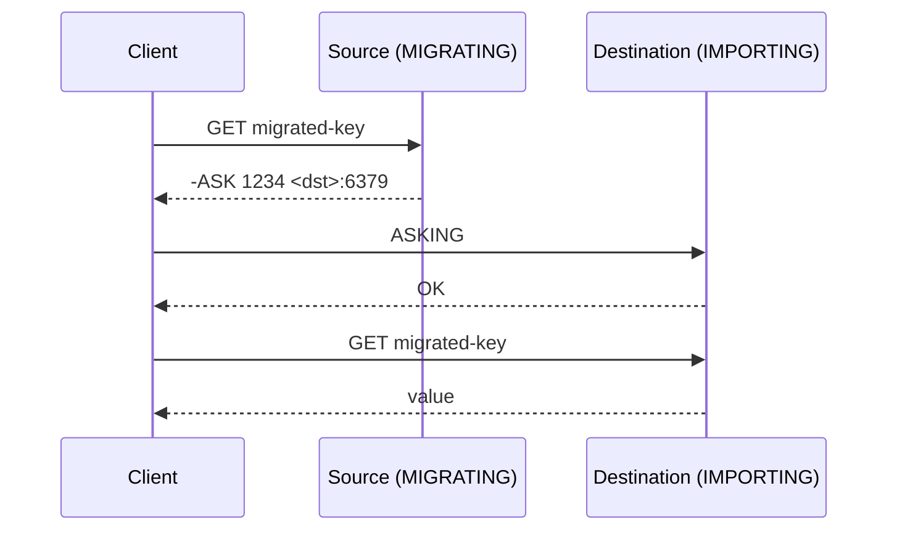

### TRYAGAIN — Multi-Key During Migration

```
-TRYAGAIN Multiple keys request during rehashing of slot
```

Returned when a multi-key command spans slots being migrated and not all keys are present locally.

### CLUSTERDOWN Errors

| Error | Condition |
|---|---|
| `CLUSTERDOWN Hash slot not served` | Slot unassigned and `cluster-require-full-coverage yes` |
| `CLUSTERDOWN The cluster is down` | Cluster in FAIL state (minority partition) |

### Redirect Priority

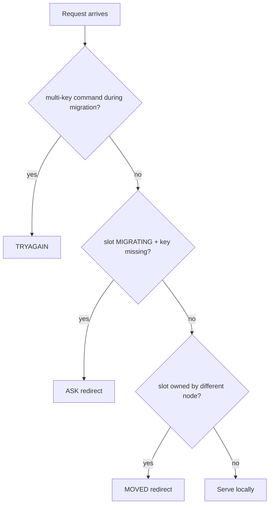

---

## 8. Cluster Failover

### Automatic Failover

Triggered when a primary enters `FAIL` state and has one or more replicas.

```mermaid
sequenceDiagram
    participant R as Replica
    participant P1 as Primary 1 (voter)
    participant P2 as Primary 2 (voter)
    participant FP as Failed Primary

    Note over R: Detects FP in FAIL state
    R->>R: Calculate rank (lower offset = higher priority)
    R->>R: Set failover_auth_time = now + rank * delay
    Note over R: Wait for failover_auth_time
    R->>P1: FAILOVER_AUTH_REQUEST
    R->>P2: FAILOVER_AUTH_REQUEST

    P1->>P1: Check: not voted this epoch,<br/>request epoch >= current,<br/>FP is FAIL
    P2->>P2: Same checks
    P1-->>R: FAILOVER_AUTH_ACK (vote YES)
    P2-->>R: FAILOVER_AUTH_ACK (vote YES)

    Note over R: Quorum reached?
    R->>R: Yes — claim all FP's slots
    R->>R: Bump configEpoch
    R->>P1,P2: Broadcast new config
    R->>P1,P2: Now serving FP's slots
```

### Replica Rank & Election Delay

Replicas with **higher replication offset** get **lower rank** (higher priority):

```c
failover_auth_time = now + (rank * CLUSTER_FAILOVER_DELAY * 2);
```

This ensures the replica with the most up-to-date data tries to failover first. Other replicas wait and cancel if a peer succeeds.

### Voting Conditions (on each primary voter)

A primary votes YES for a failover request only if:

1. Voter is a voting primary with slots
2. Request epoch >= current epoch
3. Voter has not already voted in this epoch
4. Requester is a replica
5. Requester's primary is in FAIL state
6. Requester's configEpoch >= current slot owners' configEpoch

### Manual Failover (`CLUSTER FAILOVER`)

```
CLUSTER FAILOVER [FORCE|TAKEOVER]
```

| Mode | Behavior |
|---|---|
| (none) | Coordinated — primary pauses writes, waits for replica sync |
| `FORCE` | Replica promotes without waiting for primary pause |
| `TAKEOVER` | Replica promotes immediately, skips voting (disaster recovery) |

**Coordinated flow**:
1. Replica sends `MFSTART` to primary
2. Primary pauses client writes for `CLUSTER_MF_PAUSE_MULT * cluster_mf_timeout`
3. Primary sends PING with `CLUSTERMSG_FLAG0_PAUSED` + replication offset
4. Replica waits until its offset matches (`mf_primary_offset`)
5. Sets `mf_can_start = 1`, triggers failover with `CLUSTERMSG_FLAG0_FORCEACK`

### Config Epoch Collision Resolution

When two nodes claim the same slots with different epochs:

- `clusterHandleConfigEpochCollision()` — node with higher configEpoch wins
- Losing node bumps its epoch via `clusterBumpConfigEpochWithoutConsensus()`
- Higher epoch always wins — this is the tie-breaking mechanism

---

## 9. Cluster Configuration

### nodes.conf Format

Location: specified by `cluster-config-file` (default `nodes.conf`).

```
<node-id> <ip:port@cport[,hostname][,aux=val]...> <flags> <replicaof> <ping-sent> <pong-recv> <config-epoch> <link-state> [<slot>|-]... [<slot->-<nodeid>] [<slot-<-<nodeid>]
vars currentEpoch <N> lastVoteEpoch <N>
```

### Fields

| Field | Description |
|---|---|
| `node-id` | 40-char hex SHA1 |
| `ip:port@cport` | Client port @ cluster bus port |
| `flags` | myself, master/primary, slave/replica, fail?, fail, handshake, noaddr, nofailover |
| `replicaof` | Parent node-id (for replicas) or `-` |
| `config-epoch` | Monotonically increasing epoch for this node |
| `link-state` | connected / disconnected |
| Slots | ranges (0-5460), single (5461), `[slot->-dest]` migrating, `[slot-<-source]` importing |
| Aux fields | `shard-id`, `nodename`, `tcp-port`, `tls-port`, `client-ipv4`, etc. |

### Persistence

Written atomically: write to temp file → rename → fsync. Locked with `flock()`.

**9.1 change**: Failing to save cluster config file no longer exits the process. `cluster-config-save-behavior` option controls save behavior.

### Loading

`clusterLoadConfig()` parses the file on startup. Validates:
- Monotonic config epochs
- Valid slot assignments
- No duplicate node IDs
- Consistent replica relationships

---

## 10. Multi-Database Cluster Mode (9.0+)

**New in Valkey 9.0**: Cluster mode now supports multiple databases (numbered databases), removing the long-standing limitation of only DB 0 in cluster mode.

This affects:
- `SELECT` command works in cluster mode
- Keys in different databases are tracked separately per slot
- RDB/cluster persistence handles multi-DB state
- `CLUSTER FLUSHSLOT` can flush specific slots

---

## 11. Replica Migration

When a primary becomes orphaned (no working replicas), replicas from primaries with multiple replicas can migrate to the orphaned primary.

### Conditions

| Parameter | Default | Description |
|---|---|---|
| `cluster-allow-replica-migration` | yes | Enable automatic replica migration |
| `cluster-migration-barrier` | 1 | Minimum replicas that must remain on source |
| `CLUSTER_REPLICA_MIGRATION_DELAY` | 5000ms | Wait before migrating |

### Flow

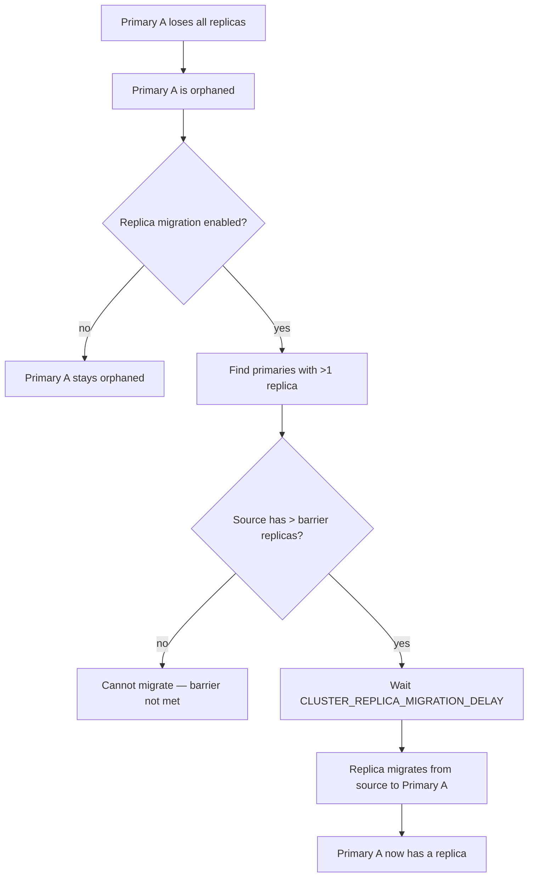

### Sub-Replica Elections

When a primary becomes a replica of its own replica (during failover), a chain is created. The cluster detects this and the new replica connects to its grand-primary to fix the chain.

---

## 12. Failure Scenarios

### 12.1 Split Brain

**Scenario**: Network partition creates two groups of primaries, both believing they own the same slots.

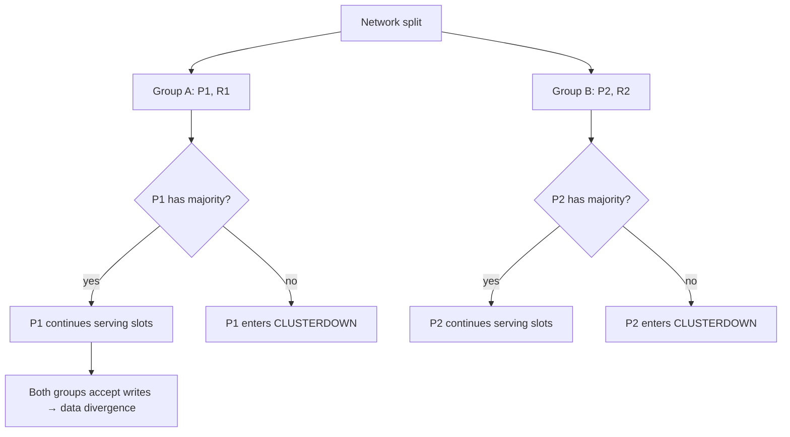

**Protections**:
1. **ConfigEpoch collision**: Higher epoch wins. Losing node bumps epoch.
2. **Quorum-based failover**: Needs majority to vote. In minority partition, failover cannot proceed.
3. **`cluster-require-full-coverage`**: If enabled, any uncovered slot → CLUSTERDOWN.

**Limitation**: With even number of primaries, both partitions could theoretically have a majority → **data divergence on partition heal**.

**Recommendation**: Use odd number of primaries (3, 5, 7) to prevent ambiguous splits.

### 12.2 Mass Primary Failure

Multiple primaries fail simultaneously. Built-in protections:

- `clusterGetFailedPrimaryRank()` adds delay based on `shard_id` ordering — prevents simultaneous elections
- `cluster-replica-validity-factor` limits how old a failure report can be for valid failover
- Replicas with higher replication offset go first

### 12.3 Slot Coverage Gap

A slot is unassigned (no primary owns it).

```
cluster-require-full-coverage yes  → CLUSTERDOWN for ALL requests
cluster-require-full-coverage no   → uncovered slot → CLUSTERDOWN Hash slot not served
                                     covered slots   → served normally
```

**Common causes**:
- Node removed without reassigning its slots
- Failed node with no replicas
- Incomplete resharding operation

### 12.4 Orphaned Primary (Lost All Slots)

A primary migrates away all its slots.

| Setting | Behavior |
|---|---|
| `cluster-allow-replica-migration yes` | Empty primary automatically becomes a replica of the new slot owner |
| `cluster-allow-replica-migration no` | Primary stays as empty primary, logs warning |

### 12.5 Gossip Flooding in Large Clusters

In clusters with >1000 nodes:

- `clusterCron` runs 10x/second, sampling only 5 nodes per iteration
- Gossip propagation slows down linearly with cluster size
- Failure detection latency increases

**Mitigation**: Reduce `cluster-node-timeout` for faster detection, but this increases false positives in high-latency networks.

### 12.6 Multi-Key Command During Migration

`MGET key1 key2` where both keys are in the same migrating slot but not all present locally:

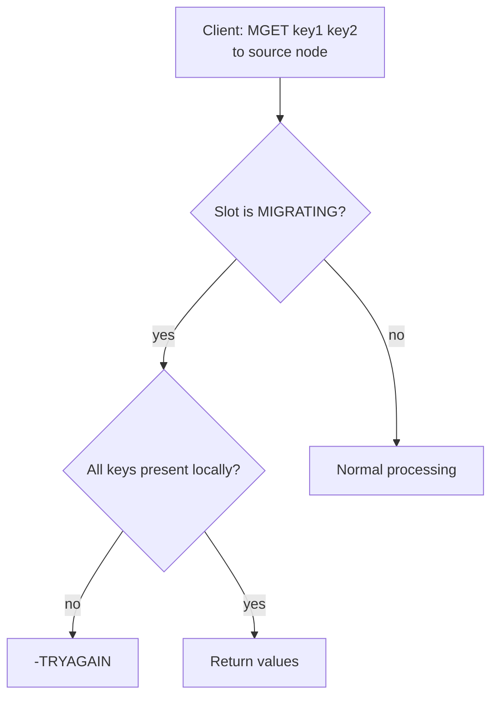

### 12.7 Minority Partition — Writable Delay

After a primary loses and then regains quorum:

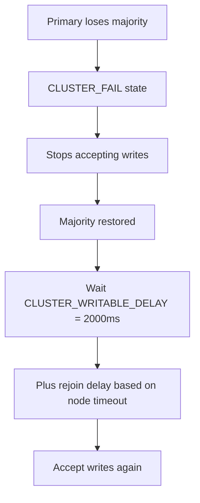

The delay allows cluster configuration updates to propagate before accepting writes.

### 12.8 Cluster Configuration Corruption

**Symptoms**:
- Node refuses to start or joins with wrong topology
- Duplicate node IDs
- Incorrect slot assignments
- Epoch rollback (epoch decreased)

**Recovery**:
1. Stop all nodes
2. Fix or regenerate `nodes.conf`
3. Use `CLUSTER MEET` to rebuild topology
4. Last resort: `CLUSTER RESET` and rebuild from scratch

### 12.9 Divergent Shard ID

Nodes in the same shard may have different `shard-id` values (e.g., after improper node replacement). The cluster converges to the primary's shard ID automatically. Detected via gossip — nodes update their shard-id to match the primary's.

---

## 13. Configuration Reference

### Cluster Core

| Parameter | Default | Description |
|---|---|---|
| `cluster-enabled` | no | Enable cluster mode |
| `cluster-config-file` | nodes.conf | Path to cluster configuration file |
| `cluster-node-timeout` | 15000ms | Timeout before marking node as PFAIL. **5000–10000ms for low-latency networks.** |
| `cluster-require-full-coverage` | yes | If any slot is uncovered, return CLUSTERDOWN for all requests |
| `cluster-allow-reads-when-down` | no | Allow reads when cluster is in FAIL state |

### Replica & Migration

| Parameter | Default | Description |
|---|---|---|
| `cluster-allow-replica-migration` | yes | Allow automatic replica migration |
| `cluster-migration-barrier` | 1 | Min replicas that must remain on source during migration |
| `cluster-replica-validity-factor` | 10 | Max disqualification time factor for failover |
| `cluster-allow-pubsubshard-when-down` | no | Allow sharded pub/sub when cluster is down |

### Failover

| Parameter | Default | Description |
|---|---|---|
| `cluster-replica-no-failover` | no | Prevent replica from failing over |
| `cluster-manual-failover-timeout` | (varies) | Timeout for manual failover coordination |
| `cluster-failover-on-shutdown` | (varies) | Auto-trigger failover on SIGTERM |

### Announcement

| Parameter | Default | Description |
|---|---|---|
| `cluster-announce-ip` | (auto) | Override announced IP |
| `cluster-announce-port` | (auto) | Override announced client port (9.0+) |
| `cluster-announce-tls-port` | (auto) | Override announced TLS port |
| `cluster-announce-bus-port` | (auto) | Override announced bus port |
