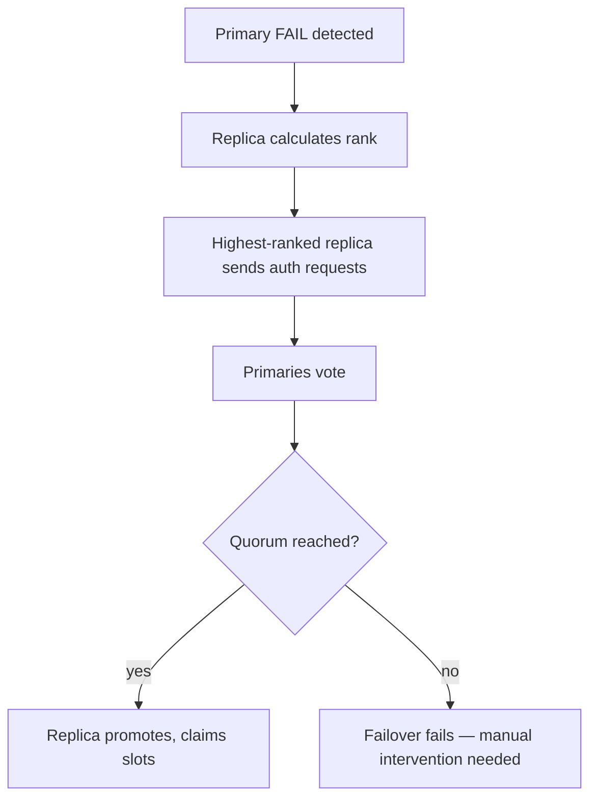
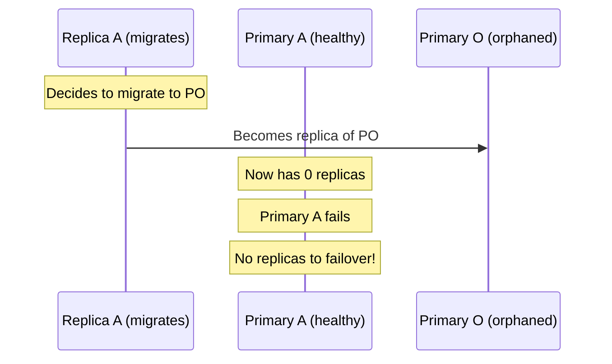
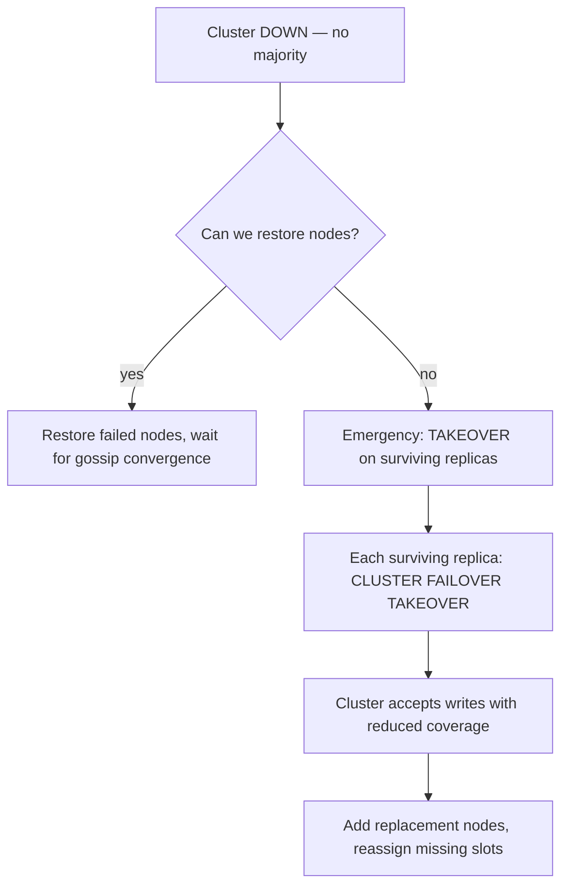
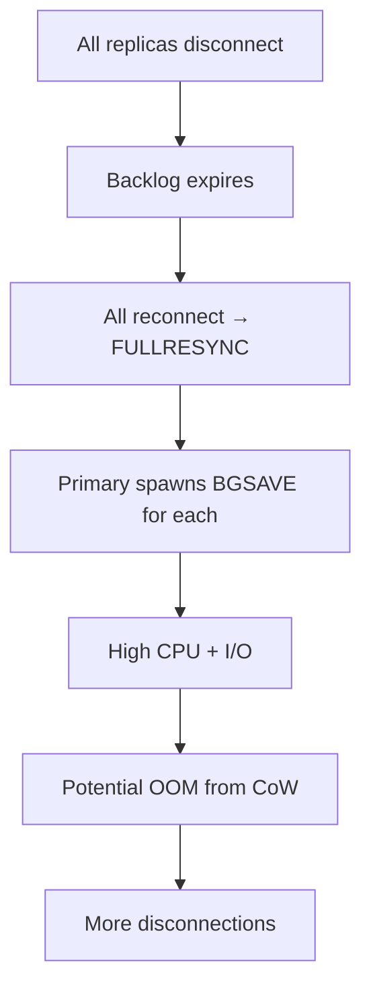

# 05 — Self-Healing & Admin Intervention

> Based on Valkey 9.1 codebase. Covers automatic recovery mechanisms and scenarios requiring manual admin intervention for running a managed Valkey service in production.

---

## Table of Contents

1. [Self-Healing Mechanisms](#1-self-healing-mechanisms)
2. [Automatic Failover — What Can Go Wrong](#2-automatic-failover--what-can-go-wrong)
3. [Cluster Down — Recovery Scenarios](#3-cluster-down--recovery-scenarios)
4. [Inconsistent Data — Detection and Recovery](#4-inconsistent-data--detection-and-recovery)
5. [Stuck Failover](#5-stuck-failover)
6. [Memory Fragmentation](#6-memory-fragmentation)
7. [Persistence Corruption](#7-persistence-corruption)
8. [Replication Breakage](#8-replication-breakage)
9. [Operational Runbooks](#9-operational-runbooks)
10. [Monitoring Checklist](#10-monitoring-checklist)

---

## 1. Self-Healing Mechanisms

Valkey has several built-in self-healing capabilities. Understanding what is automatic vs. what requires intervention is critical for operating at scale.

### What Heals Automatically

| Mechanism | Trigger | Recovery | Limitations |
|---|---|---|---|
| **Replica auto-reconnect** | Primary connection lost | Reconnect → PSYNC → partial/full resync | Requires backlog for partial; full resync is expensive |
| **Cluster failover** | Primary enters FAIL state (quorum) | Replica promotes, claims slots | Needs majority of primaries to vote |
| **Backlog trimming** | Backlog exceeds configured size | Incremental trim when safe | Blocked if slow replica holds refs |
| **Active expire** | Keys approaching expiry | Background eviction cycle | Only processes a fraction per cycle |
| **Lazy free** | Large object deletion | Async free via bio thread | Doesn't prevent latency spikes from very large objects |
| **Config epoch collision** | Two nodes claim same slots | Higher epoch wins | Requires gossip to propagate |
| **Child process crash** | BGSAVE/AOFRW child fails | Server detects via waitpid, resets state | Data from failed save is lost |
| **Cluster gossip repair** | Stale node info | Gossip converges to current state | Slow in large clusters |

### What Requires Admin Intervention

| Situation | Why Automatic Recovery Fails | Admin Action Required |
|---|---|---|
| Cluster DOWN (no majority) | Quorum cannot be reached | Manual failover or config override |
| Data inconsistency after split brain | Both sides accepted writes | Manual reconciliation |
| Stuck failover | Replica can't get quorum | `CLUSTER FAILOVER TAKEOVER` |
| Persistence corruption | RDB/AOF checksum mismatch | Restore from backup |
| Memory fragmentation extreme | Defrag can't keep up | MEMORY PURGE, restart, or tune |
| Replication backlog expired | All replicas need full resync | Monitor and resize backlog |
| Orphaned primary | No replicas, no slots | Manual slot assignment or node removal |

---

## 2. Automatic Failover — What Can Go Wrong

### The Happy Path



### Failure Modes

#### 2.1 No Quorum — Minority Partition

**Scenario**: More than half of primaries are unreachable. The remaining replicas cannot get enough votes.

```
Cluster: 3 primaries (P1, P2, P3), each with 1 replica
P1 and P2 fail → only P3 alive
Quorum needed: 2 votes
Available votes: 1 (P3 itself)
Result: NO quorum → failover blocked
```

**Admin intervention**:
- Option 1: Restore one of the failed primaries
- Option 2: Use `CLUSTER FAILOVER TAKEOVER` on the surviving replica (skips voting — disaster recovery only)
- Option 3: `CLUSTER RESET` and rebuild topology

#### 2.2 Replica Rank Race — Multiple Replicas Competing

**Scenario**: Multiple replicas of the same failed primary all try to failover simultaneously.

**Built-in protection**: Replicas with higher replication offset get lower rank and go first. Others wait and cancel if a peer succeeds.

**What can go wrong**: If replication offsets are nearly identical, the delay between attempts is small, potentially causing multiple elections in the same epoch.

**Resolution**: Only one can get quorum. The others detect the successful promotion via gossip and cancel.

#### 2.3 Epoch Collision — Two Primaries Claim Same Slots

**Scenario**: After a network partition heals, two nodes claim the same slots with different configEpochs.

**Automatic resolution**: `clusterHandleConfigEpochCollision()` — node with higher epoch wins. Losing node bumps its epoch.

**What can go wrong**: If the losing node has already accepted writes on those slots during the partition, those writes are **lost** — the slot ownership transfers to the winner.

**Admin action**: Check for data loss after partition heal. Manually reconcile if needed.

#### 2.4 Replica Migration Interfering with Failover

**Scenario**: A replica migrates from a healthy primary to an orphaned primary. Meanwhile, the healthy primary fails.



**Built-in protection**: `cluster-migration-barrier` (default 1) ensures at least one replica remains on the source before migration is allowed.

---

## 3. Cluster Down — Recovery Scenarios

### Detecting Cluster DOWN

```bash
# Check cluster state
valkey-cli -c CLUSTER INFO | grep cluster_state
# Expected: cluster_state:ok
# Problem:  cluster_state:fail

# Check slot coverage
valkey-cli -c CLUSTER INFO | grep cluster_slots_assigned
# Expected: 16384
# Problem:  < 16384

# Check for failed nodes
valkey-cli -c CLUSTER NODES | grep fail
```

### Scenario 1: Single Primary Failure (Has Replica)

**Automatic recovery**: Replica detects FAIL, gets quorum, promotes. No admin action needed.

**Verify**:
```bash
valkey-cli -c CLUSTER NODES | grep myself
# Should show the promoted node as master
```

### Scenario 2: Single Primary Failure (No Replica)

**Problem**: No replica to failover. Slot is uncovered.

**Admin action**:
```bash
# Option 1: Create a new node and assign the orphaned slots
valkey-cli -c CLUSTER ADDSLOTS <slot-range>

# Option 2: If the old node can be recovered
# Start the old node — it will rejoin with its slots
```

### Scenario 3: Mass Primary Failure (No Majority)

**Problem**: Cluster enters FAIL state. All requests return CLUSTERDOWN.



**Emergency recovery**:
```bash
# On each surviving replica with no failing primary:
valkey-cli -c CLUSTER FAILOVER TAKEOVER

# This skips voting — use only in emergencies!
# After TAKEOVER, the cluster will have partial slot coverage.
# Missing slots must be reassigned manually.
```

### Scenario 4: Slot Coverage Gap

**Problem**: A slot is unassigned (no primary owns it).

```bash
# Find unassigned slots
valkey-cli -c CLUSTER SLOTS
# Compare with expected 0–16383 range

# If cluster-require-full-coverage is yes: ALL requests fail
# If no: only requests to uncovered slots fail
```

**Admin action**:
```bash
# Assign the slot to an existing primary
valkey-cli -c CLUSTER ADDSLOTS <slot>

# Or use cluster-manager tools to rebalance
```

### Scenario 5: nodes.conf Corruption

**Problem**: Cluster config file is corrupted. Node won't start or joins with wrong topology.

**Symptoms**:
- Node crashes on startup with cluster config error
- Duplicate node IDs in `CLUSTER NODES`
- Incorrect slot assignments
- Epoch rollback

**Admin action**:
```bash
# 1. Stop all nodes
# 2. Backup existing nodes.conf files
# 3. Fix or regenerate nodes.conf
# 4. Start nodes one by one
# 5. Use CLUSTER MEET to rebuild topology

# Last resort: full rebuild
valkey-cli -c CLUSTER RESET HARD
# Then re-create cluster from scratch
```

---

## 4. Inconsistent Data — Detection and Recovery

### Causes of Data Inconsistency

| Cause | Mechanism | Detection |
|---|---|---|
| **Split brain** | Both partitions accept writes | Compare data on both sides after heal |
| **Partial failover** | New primary has stale data | Compare replication offset with old primary |
| **Network-induced divergence** | Replicas diverge during extended partition | Compare key counts, checksums |
| **Migration race** | Keys lost during slot migration | Check key count before/after migration |
| **Expired key replication** | DEL not propagated for lazy-expired keys | Keys present on replica but expired on primary |

### Detecting Inconsistency

```bash
# Compare key counts across nodes
valkey-cli -h <node1> DBSIZE
valkey-cli -h <node2> DBSIZE

# Check replication lag
valkey-cli -h <primary> INFO replication | grep lag

# For cluster: check slot assignment consistency
valkey-cli -c CLUSTER NODES

# Check for keys in wrong slots (cluster mode)
valkey-cli -c CLUSTER KEYSLOT <key>
```

### Recovery Options

**Option 1: Resync replica**
```bash
# Force full resync on a replica
valkey-cli -h <replica> REPLICAOF <primary-ip> <primary-port>
# This triggers a full RDB transfer
```

**Option 2: Reassign slots**
```bash
# For cluster: reassign slots from inconsistent node
valkey-cli -c CLUSTER SETSLOT <slot> NODE <correct-node-id>
```

**Option 3: Restore from backup**
```bash
# Stop the inconsistent node
# Replace data directory with RDB/AOF from backup
# Restart
```

**Option 4: Manual reconciliation**
- Export data from both sides
- Compare and merge
- Import reconciled data
- This is the most labor-intensive but only option for split-brain data divergence

---

## 5. Stuck Failover

### Symptoms

- Primary is in FAIL state
- Replica is trying to failover but not succeeding
- `CLUSTER INFO` shows `cluster_state:fail`
- `cluster_known_nodes` is correct but no failover completes

### Diagnosing

```bash
# Check failover state on replica
valkey-cli -h <replica> CLUSTER INFO | grep -E "failover|epoch"

# Check if replica is sending auth requests
valkey-cli -h <replica> CLUSTER NODES | grep myself

# Check if primaries are voting
valkey-cli -h <primary> CLUSTER INFO | grep cluster_current_epoch
```

### Common Causes

| Cause | Fix |
|---|---|
| **No quorum** — not enough primaries alive | `CLUSTER FAILOVER TAKEOVER` |
| **Epoch too low** — requester's configEpoch < slot owners' | Wait for epoch to propagate, or use TAKEOVER |
| **Already voted** — primaries already voted in this epoch | Wait for next epoch, or use TAKEOVER |
| **Network partition** — can't reach voters | Fix network, or use TAKEOVER |
| **Replica rank too low** — other replica went first | Check if another replica already promoted |

### Force Recovery

```bash
# On the replica that should become primary:
valkey-cli -c CLUSTER FAILOVER TAKEOVER

# This:
# 1. Skips voting entirely
# 2. Immediately claims all primary's slots
# 3. Bumps configEpoch
# 4. Broadcasts new config
#
# WARNING: If another node also did TAKEOVER, you'll have
# two primaries claiming the same slots → data inconsistency
```

---

## 6. Memory Fragmentation

### Understanding Fragmentation Metrics

```bash
valkey-cli INFO memory | grep -E "frag|rss"
```

| Metric | Formula | Healthy Range |
|---|---|---|
| `mem_fragmentation_ratio` | RSS / used_memory | 1.0–1.5 |
| `mem_allocator` | Allocator name | jemalloc preferred |
| `allocator_frag_ratio` | (allocated + wasted) / allocated | < 1.1 |

### Causes

| Cause | Mechanism |
|---|---|
| **Varying allocation patterns** | Mix of small and large allocations creates holes in slabs |
| **Long uptime without restart** | Accumulated fragmentation over time |
| **Heavy delete/load cycles** | Bulk deletes free memory, but allocator holds pages |
| **CoW during BGSAVE** | Child process holds shared pages, parent creates copies |
| **Large temporary objects** | Brief large allocations fragment the address space |

### Diagnosis

```bash
# MEMORY DOCTOR provides automated diagnosis
valkey-cli MEMORY DOCTOR
# Possible outputs:
#   * high_frag — total fragmentation > 1.4 and > 10MB
#   * high_alloc_frag — allocator fragmentation > 1.1 and > 10MB
#   * high_proc_rss — RSS overhead outside allocator > 1.1
#   * big_replica_buf — replica buffers > 10MB per replica
#   * big_client_buf — client buffers > 200KB per client
```

### Recovery

#### Level 1: MEMORY PURGE (jemalloc only)

```bash
valkey-cli MEMORY PURGE
# Returns unused pages to OS via madvise(MADV_DONTNEED)
# Non-blocking, safe to run in production
# Effectiveness depends on allocator state
```

#### Level 2: Enable Active Defrag

```bash
valkey-cli CONFIG SET activedefrag yes
valkey-cli CONFIG SET active-defrag-enabled yes

# Tune CPU usage (default: low)
valkey-cli CONFIG SET active-defrag-cycle-us 100
valkey-cli CONFIG SET active-defrag-cpu-percent 10

# Monitor progress
valkey-cli INFO memory | grep defrag
```

Active defrag runs incrementally in the event loop. It relocates live data to reduce external fragmentation. **Pauses automatically** when a child process (BGSAVE/AOFRW) is running.

#### Level 3: Restart with RDB Reload

```bash
# Schedule a maintenance window
# 1. Trigger BGSAVE
valkey-cli BGSAVE

# 2. Wait for save to complete
valkey-cli LASTSAVE

# 3. Restart the instance
# On restart, Valkey loads from the compact RDB file
# Memory is freshly allocated — fragmentation is eliminated
```

#### Level 4: Emergency Restart

If memory is critically high and the instance is at risk of OOM:

```bash
# 1. Stop accepting new writes (if possible)
valkey-cli CONFIG SET maxmemory-policy noeviction

# 2. Trigger save (if memory allows)
valkey-cli BGSAVE

# 3. If save fails (OOM), accept data loss and restart
# The RDB from the last successful save will be loaded
```

### Prevention

| Strategy | Configuration |
|---|---|
| Use jemalloc | Compile with `USE_JEMALLOC` |
| Enable active defrag | `activedefrag yes` |
| Limit maxmemory | `maxmemory <value>` with eviction policy |
| Monitor fragmentation | Alert when `mem_fragmentation_ratio > 1.5` |
| Regular restarts | Schedule periodic restarts during maintenance windows |

---

## 7. Persistence Corruption

### RDB Corruption

**Detection**: CRC64 checksum mismatch during load.

```
# Error message:
# RDB CRC64 checksum mismatch. Exiting.
```

**Built-in response**: Valkey invokes `valkey-check-rdb` on the file and exits.

**Recovery**:
```bash
# 1. Check if RDB is repairable
valkey-check-rdb /path/to/dump.rdb

# 2. If repairable:
valkey-check-rdb --fix /path/to/dump.rdb

# 3. If not repairable:
# Restore from backup or replica
```

**Prevention**:
- `rdb-checksum yes` (default) — ensures CRC64 verification on load
- Regular BGSAVE — recent snapshots reduce data loss window
- Replica with `replica-serve-stale-data no` — prevents serving corrupted data

### AOF Corruption

**Detection**: RESP parsing error during load, incomplete MULTI/EXEC, truncated file.

```
# Error message:
# Unexpected EOF reading AOF file
# AOF file format error at line <N>
```

**Built-in response**:
- If `aof-load-truncated yes` (default): truncates file to last valid offset, accepts partial load
- Suggests running `valkey-check-aof --fix`

**Recovery**:
```bash
# 1. Check and fix AOF
valkey-check-aof --fix /path/to/appendonly.aof.manifest

# 2. If multi-part AOF, check individual files
valkey-check-aof --fix /path/to/appendonly.aof.<seq>.incr.aof

# 3. If AOF is unrecoverable but RDB is available:
# Disable AOF, load from RDB, re-enable AOF
valkey-cli CONFIG SET appendonly no
# Restart — loads from RDB
valkey-cli CONFIG SET appendonly yes
# Triggers BGREWRITEAOF to create fresh AOF
```

### Both RDB and AOF Corrupted

**Worst case**: Both persistence files are corrupted.

**Recovery**:
1. Restore from backup (external backup system)
2. Restore from a replica (stop replica, copy its data, restart)
3. Accept data loss and start fresh

**Prevention**:
- Multiple replicas with `min-replicas-to-write`
- Regular external backups (copy RDB/AOF to object storage)
- Monitor `lastsave` timestamp
- `appendfsync always` for maximum durability (performance trade-off)

---

## 8. Replication Breakage

### Replica Cannot Connect to Primary

**Symptoms**:
- `INFO replication` shows `connected_slaves: 0`
- Replica logs: connection refused, timeout

**Diagnosis**:
```bash
# On replica
valkey-cli INFO replication | grep master_link_status
# master_link_status:down

valkey-cli INFO replication | grep master_last_io_seconds_ago
# High value = connection lost

# Check network
valkey-cli -h <primary> PING
```

**Common causes and fixes**:

| Cause | Fix |
|---|---|
| Primary down | Restart primary; replica auto-reconnects |
| Network issue | Fix network; replica auto-reconnects |
| Primary IP changed | Update `REPLICAOF` on replica |
| Authentication failure | Check `masterauth` config on replica |
| Primary `bind` address | Check primary `bind` config allows replica IP |
| Firewall/SG rules | Allow traffic on primary port |

### Full Resync Storm

**Scenario**: All replicas lose connection, backlog expires, all trigger FULLRESYNC simultaneously.



**Prevention**:
- Size `repl-backlog-size` large enough to hold the expected disconnection window
- Monitor `sync_full` vs `sync_partial_ok` in `INFO stats`
- Stagger replica reconnections if possible

**Emergency response**:
```bash
# 1. Check primary memory
valkey-cli INFO memory | grep used_memory

# 2. If OOM imminent, reduce replica count temporarily
valkey-cli -h <replica1> REPLICAOF NO ONE
# This stops replication for one replica, reducing primary load

# 3. After primary stabilizes, re-connect replicas one at a time
valkey-cli -h <replica1> REPLICAOF <primary-ip> <primary-port>
```

### Replication Lag Growing

**Symptoms**:
```bash
valkey-cli INFO replication | grep slave
# slave0:lag=30  (growing)
```

**Common causes**:

| Cause | Diagnosis | Fix |
|---|---|---|
| Slow replica (disk I/O) | `iostat` on replica, check disk utilization | Faster disks, reduce write load |
| Network bandwidth saturated | `iftop` / `nethogs` between primary and replica | Increase bandwidth, enable diskless sync |
| Large commands | Check for bulk operations (KEYS, SMEMBERS on large sets) | Optimize application queries |
| Single-threaded bottleneck | `valkey-cli INFO stats` → `instantaneous_ops_per_sec` | Enable I/O threads, reduce command complexity |
| Output buffer limit hit | `INFO clients` → `client_recent_max_output_buffer` | Increase `client-output-buffer-limit replica` |

---

## 9. Operational Runbooks

### Runbook 1: Primary Node Failure (Cluster Mode)

```
1. DETECT: Monitoring alerts on cluster_state:fail or node down
2. ASSESS: valkey-cli -c CLUSTER INFO
   - Is cluster_state:fail?
   - How many slots are uncovered?
   - Are replicas promoting automatically?
3. WAIT: Give automatic failover 30–60 seconds
4. VERIFY: valkey-cli -c CLUSTER NODES
   - Is a new primary elected?
   - Are all slots covered?
5. IF FAILSAFE FAILED:
   - valkey-cli -c CLUSTER FAILOVER TAKEOVER (on surviving replica)
6. RECOVER: Add replacement node
   - Start new valkey-server --cluster-enabled
   - valkey-cli -c CLUSTER MEET <new-node>
   - Rebalance slots if needed
7. VALIDATE: Run health checks, verify data consistency
```

### Runbook 2: Memory Emergency (OOM Risk)

```
1. DETECT: mem_fragmentation_ratio > 2.0 or used_memory approaching maxmemory
2. ASSESS: valkey-cli MEMORY DOCTOR
3. IMMEDIATE:
   - valkey-cli MEMORY PURGE (if jemalloc)
   - valkey-cli CONFIG SET activedefrag yes (if not already)
4. IF STILL CRITICAL:
   - valkey-cli BGSAVE (if memory allows)
   - Schedule restart during maintenance window
5. IF OOM KILL IMMINENT:
   - Restart immediately
   - Accept potential data loss since last save
6. POST-RECOVERY:
   - Review memory growth pattern
   - Adjust maxmemory, eviction policy
   - Consider adding more nodes (horizontal scale)
```

### Runbook 3: Replication Failure

```
1. DETECT: connected_slaves dropped, replica lag growing
2. ASSESS: valkey-cli INFO replication (on primary and replica)
3. CHECK:
   - Is primary accessible? (PING)
   - Is masterauth correct?
   - Is network healthy?
4. IF CONNECTION ISSUE:
   - Fix network/auth
   - Replica auto-reconnects
   - Verify PSYNC succeeded (not FULLRESYNC)
5. IF FULLRESYNC NEEDED:
   - Monitor primary memory during RDB generation
   - If multiple replicas: stagger reconnections
   - Monitor CoW memory during BGSAVE
6. POST-RECOVERY:
   - Verify replica data consistency
   - Review why replication broke
   - Consider increasing repl-backlog-size
```

### Runbook 4: Persistence Failure

```
1. DETECT: LASTSAVE timestamp is stale, BGSAVE fails
2. ASSESS: valkey-cli INFO persistence
   - rdb_last_bgsave_status
   - aof_last_bg_rewrite_status
   - rdb_last_save_time
3. IF BGSAVE FAILS:
   - Check disk space
   - Check permissions on data directory
   - Check for too many open files
4. IF RDB CORRUPT:
   - valkey-check-rdb --fix
   - If unfixable: restore from replica or backup
5. IF AOF CORRUPT:
   - valkey-check-aof --fix
   - If unfixable: disable AOF, restart with RDB, re-enable
6. POST-RECOVERY:
   - Trigger fresh BGSAVE
   - Verify data integrity
   - Review disk space monitoring
```

---

## 10. Monitoring Checklist

### Critical Alerts (Page On-Call)

| Metric | Threshold | Command |
|---|---|---|
| `cluster_state` | `fail` | `INFO cluster` / `CLUSTER INFO` |
| `connected_slaves` | Dropped unexpectedly | `INFO replication` |
| `used_memory` | > 90% of maxmemory | `INFO memory` |
| `mem_fragmentation_ratio` | > 2.0 | `INFO memory` |
| `master_link_status` | `down` for > 60s | `INFO replication` |
| `rdb_last_bgsave_status` | `err` | `INFO persistence` |
| `aof_last_bg_rewrite_status` | `err` | `INFO persistence` |
| `rejected_connections` | Growing | `INFO stats` |
| `evicted_keys` | Growing rapidly | `INFO stats` |
| `expired_keys` | Growing rapidly | `INFO stats` |

### Warning Alerts (Investigate)

| Metric | Threshold | Command |
|---|---|---|
| `mem_fragmentation_ratio` | > 1.5 | `INFO memory` |
| `slave*_lag` | > 10s | `INFO replication` |
| `blocked_clients` | > 10% of total | `INFO clients` |
| `instantaneous_ops_per_sec` | Dropped significantly | `INFO stats` |
| `sync_full` | Growing (should be rare) | `INFO stats` |
| `sync_partial_err` | Growing | `INFO stats` |
| `client_recent_max_output_buffer` | Growing | `INFO clients` |
| `lazyfree_pending_objects` | > 10000 | `INFO stats` |
| CoW memory during BGSAVE | > 50% of used_memory | Log output |
| `cluster_known_nodes` | Unexpected count | `CLUSTER INFO` |

### Capacity Planning Metrics

| Metric | Purpose | Command |
|---|---|---|
| `used_memory_peak` | Historical high-water mark | `INFO memory` |
| `total_commands_processed` | Throughput baseline | `INFO stats` |
| `keyspace_hits` / `keyspace_misses` | Cache efficiency | `INFO stats` |
| `connected_clients` | Connection count trends | `INFO clients` |
| `repl_backlog_histlen` | Backlog utilization | `INFO replication` |
| `aof_current_size` | AOF growth rate | `INFO persistence` |
| Per-slot key counts | Data distribution | `CLUSTER SLOTS` + `DBSIZE` per node |

### Health Check Script

```bash
#!/bin/bash
# Quick Valkey health check
HOST=${1:-127.0.0.1}
PORT=${2:-6379}

echo "=== Valkey Health Check ==="
echo ""

# Basic connectivity
valkey-cli -h $HOST -p $PORT PING 2>/dev/null
if [ $? -ne 0 ]; then
    echo "CRITICAL: Cannot connect to $HOST:$PORT"
    exit 2
fi

# Memory
FRAG=$(valkey-cli -h $HOST -p $PORT INFO memory 2>/dev/null | grep mem_fragmentation_ratio | cut -d: -f2 | tr -d '\r')
USED=$(valkey-cli -h $HOST -p $PORT INFO memory 2>/dev/null | grep used_memory_human | cut -d: -f2 | tr -d '\r')
echo "Memory: $USED used, fragmentation ratio: $FRAG"

# Replication
ROLE=$(valkey-cli -h $HOST -p $PORT INFO replication 2>/dev/null | grep role | cut -d: -f2 | tr -d '\r')
echo "Role: $ROLE"
if [ "$ROLE" = "master" ]; then
    SLAVES=$(valkey-cli -h $HOST -p $PORT INFO replication 2>/dev/null | grep connected_slaves | cut -d: -f2 | tr -d '\r')
    echo "Connected replicas: $SLAVES"
fi

# Cluster (if enabled)
CLUSTER_STATE=$(valkey-cli -h $HOST -p $PORT INFO cluster 2>/dev/null | grep cluster_state | cut -d: -f2 | tr -d '\r')
if [ -n "$CLUSTER_STATE" ]; then
    echo "Cluster state: $CLUSTER_STATE"
    if [ "$CLUSTER_STATE" != "ok" ]; then
        echo "WARNING: Cluster is in FAIL state"
    fi
fi

# Persistence
LASTSAVE=$(valkey-cli -h $HOST -p $PORT INFO persistence 2>/dev/null | grep rdb_last_save_time | cut -d: -f2 | tr -d '\r')
RDB_STATUS=$(valkey-cli -h $HOST -p $PORT INFO persistence 2>/dev/null | grep rdb_last_bgsave_status | cut -d: -f2 | tr -d '\r')
echo "Last RDB save: $(date -d @$LASTSAVE 2>/dev/null || date -r $LASTSAVE 2>/dev/null || echo $LASTSAVE), status: $RDB_STATUS"

echo ""
echo "=== End Health Check ==="
```
