# Valkey: Replication & Sharding — Deep Dive

> Based on Valkey 9.1 codebase (`src/replication.c`, `src/cluster.c`, `src/cluster_legacy.c`, `src/cluster_migrateslots.c`).

---

## Table of Contents

1. [Replication Architecture](#1-replication-architecture)
2. [PSYNC Protocol: Full vs Partial Resync](#2-psync-protocol-full-vs-partial-resync)
3. [Replication Backlog](#3-replication-backlog)
4. [Diskless & Dual-Channel Replication](#4-diskless--dual-channel-replication)
5. [Replica Promotion & Failover](#5-replica-promotion--failover)
6. [Cluster & Sharding Architecture](#6-cluster--sharding-architecture)
7. [Gossip Protocol & Node Discovery](#7-gossip-protocol--node-discovery)
8. [Hash Slots & Key Distribution](#8-hash-slots--key-distribution)
9. [Slot Migration & Resharding](#9-slot-migration--resharding)
10. [Cluster Failover](#10-cluster-failover)
11. [Redirects: MOVED, ASK, TRYAGAIN](#11-redirects-moved-ask-tryagain)
12. [Edge Cases & Failure Scenarios — Replication](#12-edge-cases--failure-scenarios--replication)
13. [Edge Cases & Failure Scenarios — Cluster](#13-edge-cases--failure-scenarios--cluster)
14. [Operational Checklist](#14-operational-checklist)

---

## 1. Replication Architecture

Valkey uses **single-primary, multi-replica** replication. The primary handles all writes; replicas receive a stream of write commands and apply them asynchronously.

### Key Source Files

| File | Purpose |
|------|---------|
| `src/replication.c` | Core replication engine (~5757 lines) |
| `src/server.h` | State structs: `repl_state`, `replBacklog`, `ClientReplicationData` |

### Replica State Machine (replica → primary)

```
REPL_STATE_NONE
    │
    ▼
REPL_STATE_CONNECT          ── must connect to primary
    │
    ▼
REPL_STATE_CONNECTING       ── TCP/TLS socket established
    │
    ▼
REPL_STATE_RECEIVE_PING_REPLY
    │
    ▼
REPL_STATE_SEND_HANDSHAKE   ── REPLCONF capa, port, ip
    │
    ▼
REPL_STATE_RECEIVE_*_REPLY  ── auth, port, ip, capa, version, node-id
    │
    ▼
REPL_STATE_SEND_PSYNC       ── "PSYNC <replid> <offset>"
    │
    ▼
REPL_STATE_RECEIVE_PSYNC_REPLY
    ├── +FULLRESYNC  → REPL_STATE_TRANSFER (RDB download)
    ├── +CONTINUE    → REPL_STATE_CONNECTED (partial resync)
    └── +DUALCHANNELSYNC → dual-channel full sync
    │
    ▼
REPL_STATE_TRANSFER         ── receiving RDB (disk or diskless)
    │
    ▼
REPL_STATE_CONNECTED        ── steady state: receiving command stream
```

### Primary-Side Replica States (primary tracking each replica)

```
REPLICA_STATE_WAIT_BGSAVE_START  ── need to produce RDB
    │
    ▼
REPLICA_STATE_WAIT_BGSAVE_END    ── waiting for BGSAVE to finish
    │
    ▼
REPLICA_STATE_SEND_BULK          ── sending RDB to replica
    │
    ▼
REPLICA_STATE_ONLINE             ── RDB done, streaming commands
```

### Full Replication Flow (Mermaid)

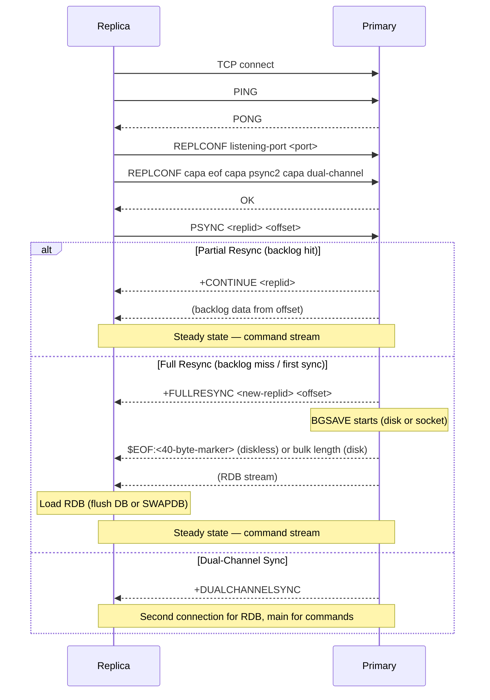

---

## 2. PSYNC Protocol: Full vs Partial Resync

PSYNC (partial resynchronization) is the heart of efficient replication. It avoids full RDB transfers when possible.

### How PSYNC Works

The replica sends: `PSYNC <replid> <offset>`

The primary checks **two conditions**:

1. **Replication ID match**: Does `replid` match `server.replid` (current primary) or `server.replid2` (previous primary, inherited during failover)?

2. **Backlog availability**: Is the requested offset within the backlog window?
   ```
   backlog.offset <= psync_offset <= backlog.offset + backlog.histlen
   ```

If both conditions are met → `+CONTINUE` (partial resync). Otherwise → `+FULLRESYNC` (full resync).

### Replication ID Inheritance

When a replica is promoted to primary via `REPLICAOF NO ONE` or cluster failover:

```
server.replid2  = server.replid       // old ID preserved
server.second_replid_offset = current_offset
server.replid   = generate_new_id()   // new ID
```

This allows sub-replicas of the newly-promoted primary to PSYNC successfully — they still know the old replid.

### PSYNC Decision Flow

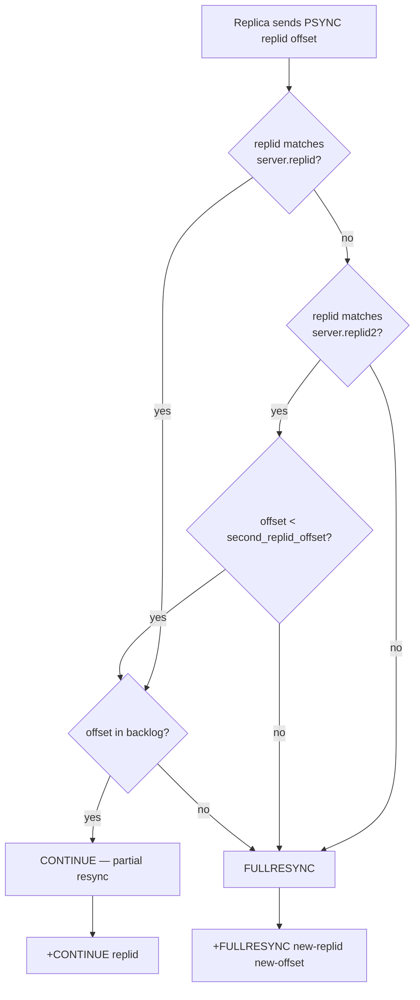

---

## 3. Replication Backlog

The replication backlog is a **shared circular buffer** that stores the replication stream. It is the key enabler of PSYNC.

### Data Structures

```c
typedef struct replBacklog {
    rax *blocks_index;       // rax tree: offset → block (fast lookup)
    replBufBlock *ref_repl_buf_node;  // first block referenced by backlog
    long long histlen;       // actual data length
    long long offset;        // primary offset of first byte in backlog
    long long unindexed_count; // blocks since last index entry
} replBacklog;

typedef struct replBufBlock {
    int refcount;            // # replicas + backlog referencing this block
    long long id;            // unique incremental ID
    long long repl_offset;   // start replication offset
    size_t size, used;       // buffer dimensions
    char buf[];              // actual data
} replBufBlock;
```

### How It Works

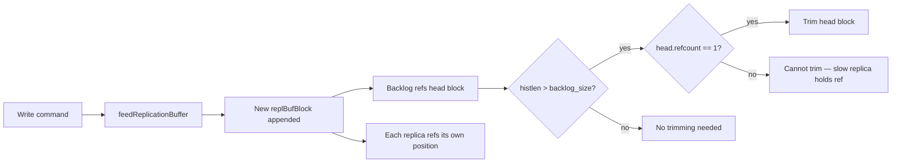

### Critical Safety Property

**The backlog can grow beyond `repl-backlog-size`** if a slow replica holds references to old blocks. Trimming is blocked while `refcount > 1`. This is intentional — disconnecting a slow replica to preserve backlog size would cause a full resync, which is often more expensive.

### Backlog Lifecycle

| Event | Behavior |
|-------|----------|
| First replica connects | `createReplicationBacklog()` — allocates backlog + new replid |
| Write command | `feedReplicationBuffer()` — appends to buffer |
| Periodic | `incrementalTrimReplicationBacklog()` — trims old blocks if safe |
| No replicas for `repl-backlog-time-limit` | `freeReplicationBacklog()` — frees backlog, changes replid |
| Replica PSYNCs | `addReplyReplicationBacklog()` — uses rax index to find offset |

---

## 4. Diskless & Dual-Channel Replication

### Disk-Based Replication (Default)

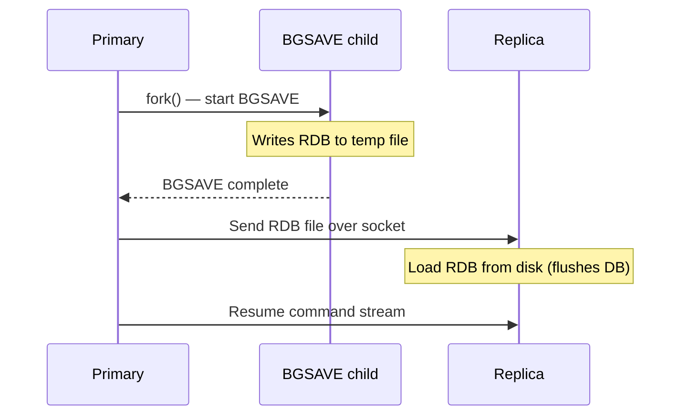

### Diskless Replication (`repl-diskless-sync yes`)

No intermediate file — RDB streams directly from BGSAVE child to replica sockets via pipe.

```mermaid
sequenceDiagram
    participant P as Primary
    participant B as RDB child
    participant R1 as Replica 1
    participant R2 as Replica 2

    P->>B: fork() — pipe to replicas
    B->>P: RDB stream via pipe
    Note over P: repl_diskless_sync_delay seconds to collect replicas
    P->>R1: Write RDB stream
    P->>R2: Write RDB stream (same stream, fan-out)
    Note over R1,R2: EOF marker detected: $EOF:<40 bytes>
    Note over R1,R2: Load RDB into memory
    P->>R1,R2: Resume command stream
```

### Diskless Load Modes (`repl-diskless-load`)

| Mode | Behavior |
|------|----------|
| `disabled` (default) | Don't use diskless load on replica side |
| `swapdb` | Load RDB into temp DB, atomic swap when done — **zero downtime** |
| `flush-before-load` | Flush existing DB, then load |
| `when-db-empty` | Only use diskless if DB is empty |

**SWAPDB mode** is the most interesting: it creates a temporary database array, loads the RDB into it, then atomically swaps with `swapMainDbWithTempDb()`. The replica continues serving reads from the old DB during the load. Only works when replication IDs match (same data history).

### Dual-Channel Replication

An advanced mode where **RDB transfer and command stream use separate TCP connections**. Enabled when both sides support `REPLICA_CAPA_DUAL_CHANNEL`.

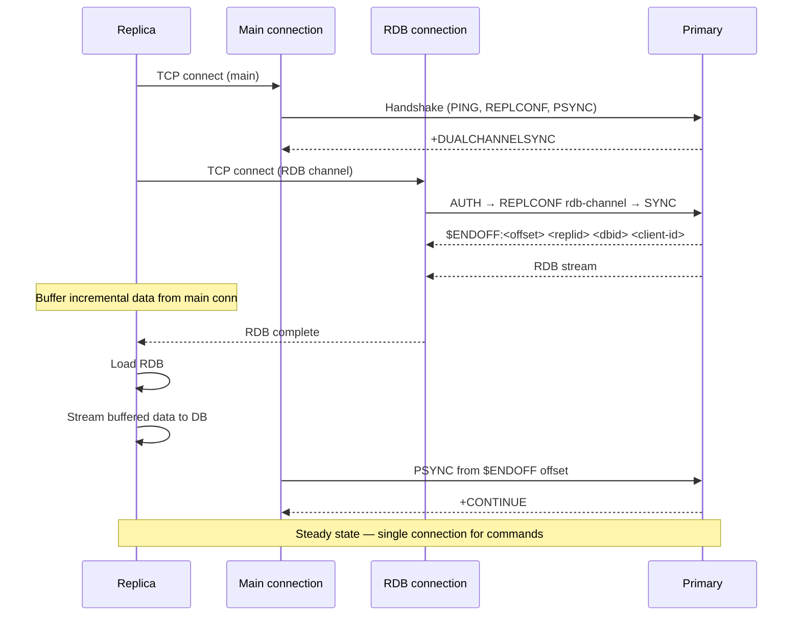

**Why dual-channel?** During a full sync with disk-based replication, the primary must pause the command stream for each replica while sending the RDB. With dual-channel, the RDB arrives on a separate connection while the main connection continues receiving and buffering the command stream, reducing total sync time.

---

## 5. Replica Promotion & Failover

### REPLICAOF NO ONE

Converts a replica into a standalone primary:

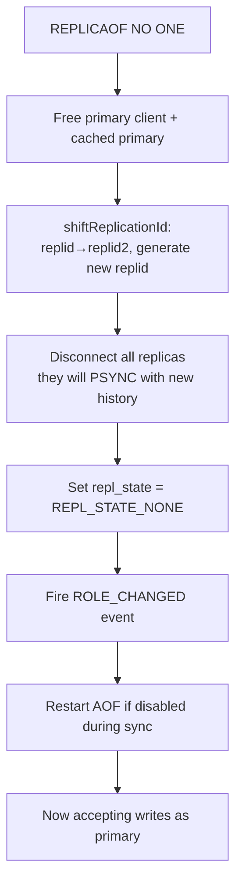

### Coordinated Failover (PSYNC FAILOVER)

A zero-downtime failover initiated by the primary:

```
FAILOVER_WAIT_FOR_SYNC → FAILOVER_IN_PROGRESS → COMPLETE
```

1. Primary sends `PSYNC <replid> <offset> FAILOVER` to target replica
2. Primary pauses writes (`PAUSED` state)
3. Primary waits until replica catches up (`repl_ack_off == primary_repl_offset`)
4. Primary initiates role swap — becomes replica of target
5. Target promotes itself to primary

### Failover Command

```
FAILOVER [TO <ip> <port>] [TAKEOVER] [ABORT] [TIMEOUT <ms>]
```

| Flag | Behavior |
|------|----------|
| (none) | Coordinated failover — primary waits for replica sync |
| `TAKEOVER` | Replica promotes immediately without primary coordination (like cluster manual failover with FORCE) |
| `ABORT` | Cancel an in-progress failover |
| `TIMEOUT` | Max time to wait for coordinated sync |

---

## 6. Cluster & Sharding Architecture

Valkey Cluster provides **automatic sharding** across multiple nodes using a hash-slot partitioning scheme.

### Key Source Files

| File | Purpose |
|------|---------|
| `src/cluster.c` | Common logic: hash slots, CRC16, MIGRATE/RESTORE/DUMP |
| `src/cluster.h` | Public API, `CLUSTER_SLOTS = 16384` |
| `src/cluster_legacy.c` | Main implementation: gossip, failover, config (~8514 lines) |
| `src/cluster_legacy.h` | Internal structs: `clusterNode`, `clusterState` |
| `src/cluster_migrateslots.c` | Atomic slot migration |
| `src/crc16.c` | CRC16 (XMODEM polynomial 0x1021) |

### Cluster Topology

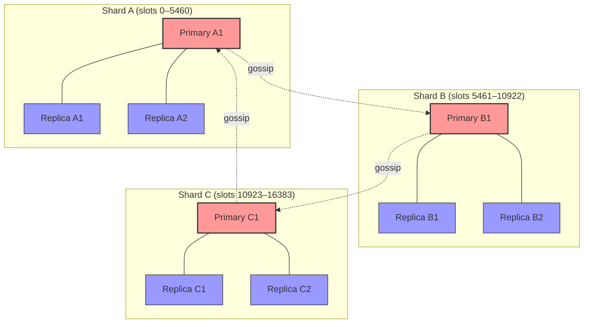

### Node States & Flags

| Flag | Meaning |
|------|---------|
| `CLUSTER_NODE_PRIMARY` | Node is a primary |
| `CLUSTER_NODE_REPLICA` | Node is a replica |
| `CLUSTER_NODE_PFAIL` | **P**ossibly **FAIL** — local timeout detection |
| `CLUSTER_NODE_FAIL` | Confirmed FAIL — quorum reached |
| `CLUSTER_NODE_HANDSHAKE` | Initial connection phase |
| `CLUSTER_NODE_MIGRATE_TO` | Eligible for replica migration |
| `CLUSTER_NODE_NOFAILOVER` | Replica will not failover |

---

## 7. Gossip Protocol & Node Discovery

Nodes communicate over a **separate TCP port** (`client_port + 10000`, constant `CLUSTER_PORT_INCR`).

### Message Types

| Type | Purpose |
|------|---------|
| `PING` | Periodic heartbeat |
| `PONG` | Reply to ping |
| `MEET` | Introduce new nodes |
| `FAIL` | Broadcast node failure |
| `PUBLISH` | Pub/sub propagation |
| `FAILOVER_AUTH_REQUEST` | Vote request for failover |
| `FAILOVER_AUTH_ACK` | Vote granted |
| `UPDATE` | Slot configuration update |
| `MFSTART` | Manual failover start |
| `PUBLISHSHARD` | Sharded pub/sub |

### Gossip Cycle

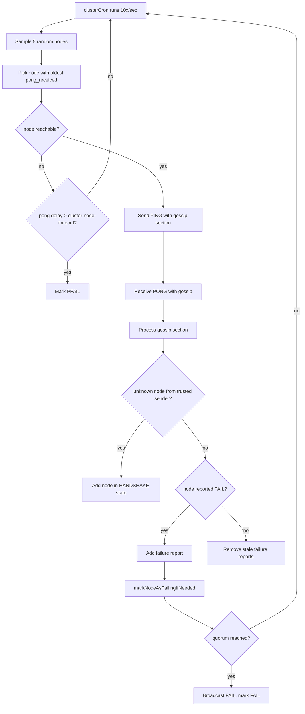

### PFAIL → FAIL Transition

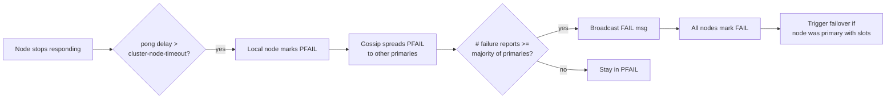

**Quorum formula**: `needed_quorum = (number_of_voting_primaries / 2) + 1`

---

## 8. Hash Slots & Key Distribution

### Slot Assignment

- **16384 hash slots** (2^14), defined as `CLUSTER_SLOTS`
- Slot = `CRC16(key) & 0x3FFF`
- CRC16 uses XMODEM polynomial (0x1021) per CCITT standards

```c
unsigned int keyHashSlot(const char *key, size_t keylen) {
    // ... handle hash tags {..} ...
    return crc16(key, keylen) & 0x3FFF;
}
```

### Hash Tags

Keys with `{...}` hash only the content between braces:

```
{user:1000}:name     → same slot
{user:1000}:profile  → same slot
{user:1000}:posts    → same slot
```

This enables **multi-key operations** (SUNION, MGET, etc.) on related keys.

### Slot Distribution (Typical 3-Primary Setup)

```
┌─────────────────┬──────────────────┬──────────────────┐
│  Primary A      │  Primary B       │  Primary C       │
│  Slots 0-5460   │  Slots 5461-10922│  Slots 10923-16383│
│  (5461 slots)   │  (5462 slots)    │  (5461 slots)    │
└─────────────────┴──────────────────┴──────────────────┘
     16384 total slots
```

---

## 9. Slot Migration & Resharding

### Traditional Migration

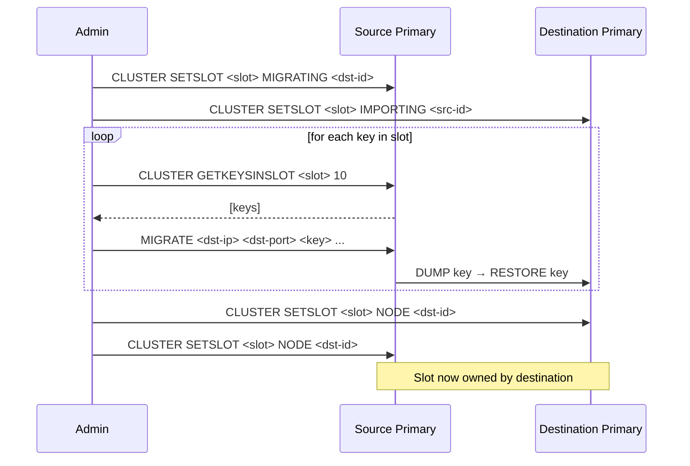

### Migration States During Transfer

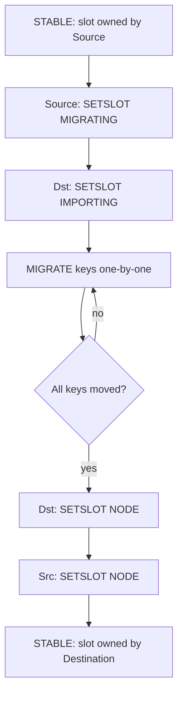

During migration:
- **Source** with `MIGRATING` flag: serves keys that exist locally, sends `ASK` redirect for missing keys
- **Destination** with `IMPORTING` flag: serves keys only from clients with `ASKING` flag set

### Atomic Slot Migration (`CLUSTER MIGRATESLOTS`)

A newer mechanism with a formal state machine that persists in RDB:

**Export states**: `CONNECTING → SEND_AUTH → SNAPSHOTTING → STREAMING → FAILOVER_PAUSED → FAILOVER_GRANTED`

**Import states**: `WAIT_ACK → RECEIVE_SNAPSHOT → WAITING_FOR_PAUSED → FAILOVER_REQUESTED → FAILOVER_GRANTED → SUCCESS`

Uses `CLUSTER SYNCSLOTS ESTABLISH/ACK/SNAPSHOT-EOF/PAUSED/FAILOVER-GRANTED` protocol and persists via `RDB_OPCODE_SLOT_IMPORT`.

---

## 10. Cluster Failover

### Automatic Failover

Triggered when a primary enters `FAIL` state and has one or more replicas.

```mermaid
sequenceDiagram
    participant R as Replica
    participant P1 as Primary 1<br/>(voter)
    participant P2 as Primary 2<br/>(voter)
    participant FP as Failed Primary

    Note over R: Detects FP in FAIL state
    R->>R: Calculate rank (lower offset = higher priority)
    R->>R: Set failover_auth_time = now + rank * delay
    Note over R: Wait for failover_auth_time
    R->>P1: FAILOVER_AUTH_REQUEST
    R->>P2: FAILOVER_AUTH_REQUEST

    P1->>P1: Check: not voted this epoch,<br/>request epoch >= current,<br/>FP is FAIL
    P2->>P2: Check: same conditions
    P1-->>R: FAILOVER_AUTH_ACK (vote YES)
    P2-->>R: FAILOVER_AUTH_ACK (vote YES)

    Note over R: Quorum reached?
    R->>R: Yes — claim all FP's slots
    R->>R: Bump configEpoch
    R->>P1,P2: Broadcast new config
    R->>P1,P2: Now serving FP's slots
```

### Replica Rank & Election Delay

Replicas with **higher replication offset** get **lower rank** (higher priority):

```c
failover_auth_time = now + (rank * CLUSTER_FAILOVER_DELAY * 2);
```

This ensures the replica with the most up-to-date data tries to failover first. Other replicas wait and cancel if a peer succeeds.

### Manual Failover (`CLUSTER FAILOVER`)

```
CLUSTER FAILOVER [FORCE|TAKEOVER]
```

| Mode | Behavior |
|------|----------|
| (none) | Coordinated — primary pauses writes, waits for replica sync |
| `FORCE` | Replica promotes without waiting for primary pause |
| `TAKEOVER` | Replica promotes immediately, skips voting (for disaster recovery) |

**Coordinated failover flow**:
1. Replica sends `MFSTART` to primary
2. Primary pauses client writes for `CLUSTER_MF_PAUSE_MULT * cluster_mf_timeout`
3. Primary sends PING with `CLUSTERMSG_FLAG0_PAUSED` + replication offset
4. Replica waits until its offset matches (`mf_primary_offset`)
5. Sets `mf_can_start = 1`, triggers failover with `CLUSTERMSG_FLAG0_FORCEACK`

---

## 11. Redirects: MOVED, ASK, TRYAGAIN

### MOVED — Permanent Redirect

```
-MOVED <slot> <ip>:<port>
```

Returned when a key's slot is owned by a different node. **Client must update its slot map.**

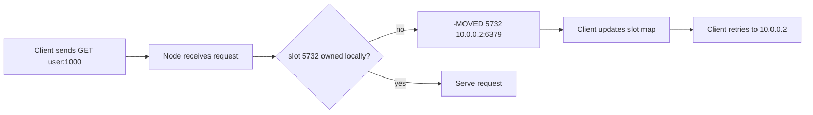

### ASK — Temporary Redirect (during migration)

```
-ASK <slot> <ip>:<port>
```

Returned when a slot is `MIGRATING` and the key doesn't exist on the source (already migrated). Client must send `ASKING` before the actual command.

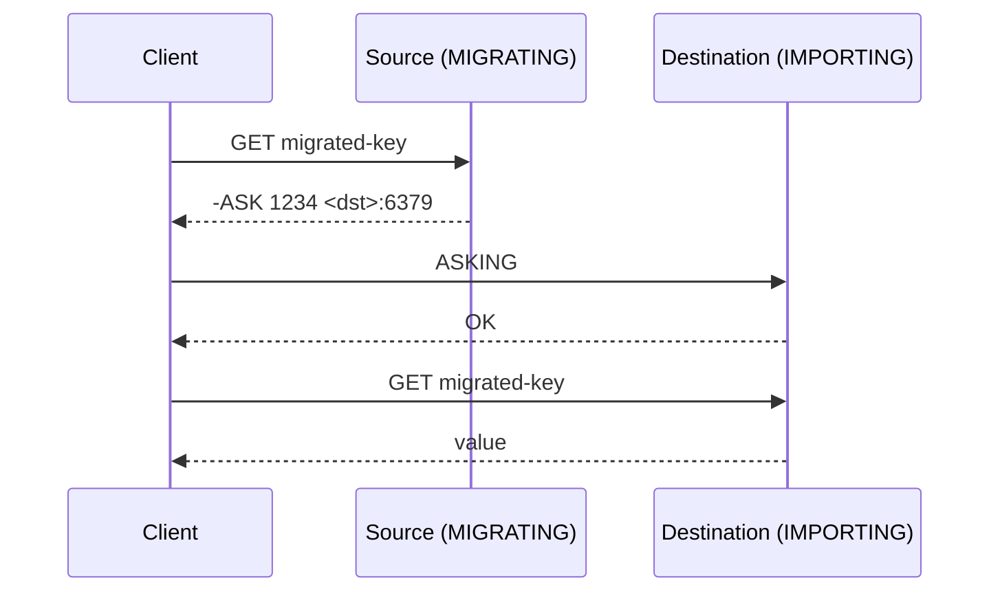

### TRYAGAIN — Multi-Key During Migration

```
-TRYAGAIN Multiple keys request during rehashing of slot
```

Returned when a multi-key command (e.g., `MGET key1 key2`) spans slots that are being migrated and not all keys are present locally.

### Redirect Priority

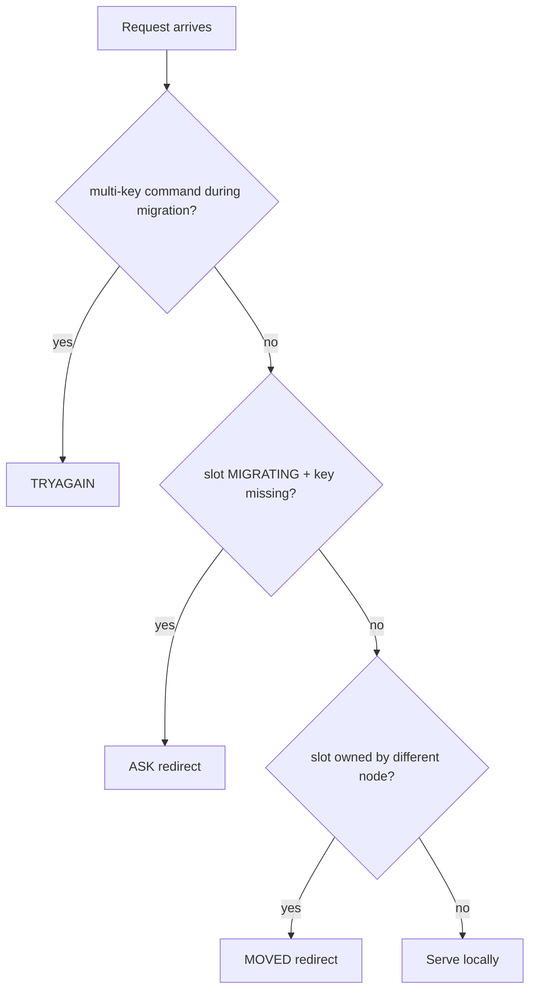

### CLUSTERDOWN Errors

| Error | Condition |
|-------|-----------|
| `CLUSTERDOWN Hash slot not served` | Slot unassigned and `cluster-require-full-coverage yes` |
| `CLUSTERDOWN The cluster is down` | Cluster in FAIL state (minority partition) |

---

## 12. Edge Cases & Failure Scenarios — Replication

### 12.1 Backlog Overflow → Full Resync

**Scenario**: Replica falls behind, its PSYNC offset is outside the backlog window.

```
[Primary backlog]
offset=1000000, histlen=500000  → valid range: [1000000, 1500000]
[Replica PSYNC]
offset=800000  → OUTSIDE backlog → FULLRESYNC
```

**Symptoms**:
- Full RDB transfer starts
- Primary spawns BGSAVE
- Replica serves stale data (or returns `MASTERDOWN` if `replica-serve-stale-data no`)
- High memory usage during BGSAVE + RDB transfer

**Mitigation**:
- Increase `repl-backlog-size`
- Monitor replica lag (`INFO replication` → `repl_backlog_histlen`)
- Use `repl-backlog-time-limit` to keep backlog alive longer

### 12.2 Slow Replica Holding Backlog References

**Scenario**: A slow replica references old blocks. The backlog cannot trim them even though `histlen > repl_backlog_size`.

```
[Backlog]
repl_backlog_size = 64MB
actual histlen    = 128MB  ← grew because slow replica holds refs
```

**Symptoms**:
- Primary memory grows unbounded
- `INFO memory` shows growing `repl_backlog` usage
- Only one replica is slow, others are fine

**Root cause**: `incrementalTrimReplicationBacklog()` skips blocks with `refcount > 1`.

**Mitigation**:
- Monitor `client-output-buffer-limit replica`
- Disconnect chronically slow replicas
- The block size is capped at `repl_backlog_size / 16` to limit damage

### 12.3 Network Partition — Primary Isolated

**Scenario**: Primary loses connectivity to all replicas.

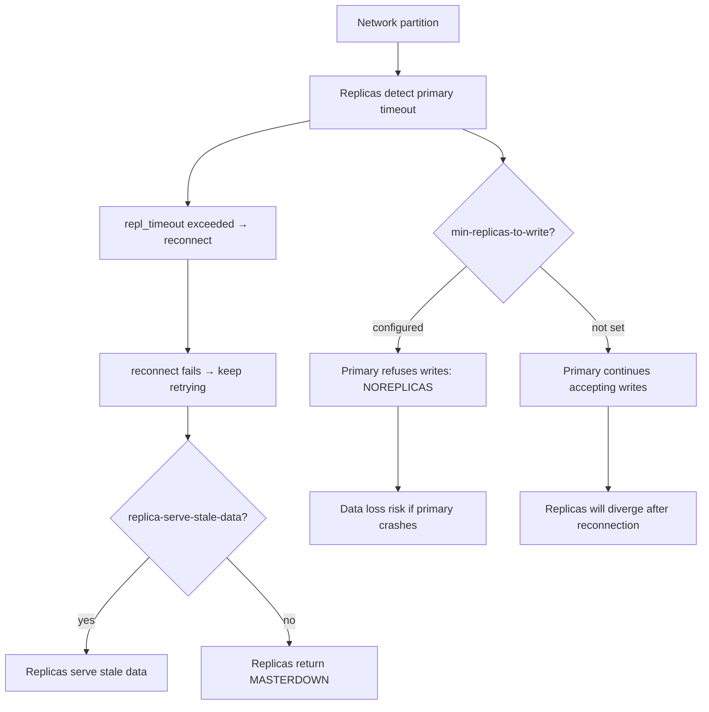

**Symptoms**:
- Primary returns `NOREPLICAS` if `min-replicas-to-write` is set
- Replicas serve stale data or return `MASTERDOWN`
- After partition heals: PSYNC if backlog intact, FULLRESYNC otherwise

### 12.4 Primary Crash During BGSAVE

**Scenario**: Primary crashes while generating RDB for a replica.

**Outcome**:
- Replica detects connection drop → `replicationHandlePrimaryDisconnection()`
- Caches primary client for PSYNC attempt
- If primary restarts: replica reconnects, attempts PSYNC
- If PSYNC fails (new replid): full resync from scratch

**Risk**: The partially-transmitted RDB is lost. The replica must start over.

### 12.5 Chained Replication — Sub-Replica Orphan

**Scenario**: A → B (replica) → C (sub-replica of B). B is promoted to primary.

**What happens**: `replicationAttachToNewPrimary()` disconnects all sub-replicas and frees the backlog. C must reconnect to B and will likely need a full resync.

### 12.6 Expired Key Replication Inconsistency

**Scenario**: Primary replicates `INCR` on an expired key. The key is lazily expired on the primary but the DEL is not propagated.

**Result**: The replica keeps the expired key (with old value) until it is accessed. This is by design — see test `replication-3.tcl`.

### 12.7 Output Buffer Limit During PSYNC

**Scenario**: Replica reconnects for PSYNC. The output buffer needed to replay the backlog exceeds `client-output-buffer-limit`.

**Special case**: During PSYNC, the replica is **NOT closed** for exceeding buffer limits — even if the buffer exceeds the hard limit. This allows partial resync to complete. The soft limit timer is also suspended.

### 12.8 Diskless Sync with Many Replicas

**Scenario**: Multiple replicas trigger full sync simultaneously with `repl-diskless-sync yes`.

**Behavior**:
- Primary waits `repl-diskless_sync_delay` seconds to collect replicas
- Starts immediately if `repl-diskless_sync_max_replicas` reached
- All replicas receive the **same RDB stream** (fan-out)

**Risk**: If a replica joins after the RDB child started, it misses the stream and must wait for the next BGSAVE.

### 12.9 Replication Storm After Mass Reconnect

**Scenario**: All replicas lose connection to primary simultaneously (e.g., network switch restart).

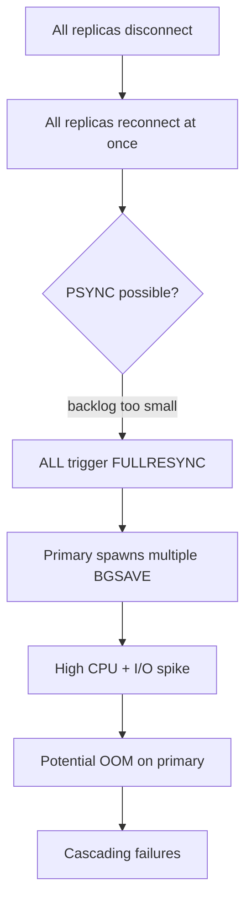

**Mitigation**:
- Size `repl-backlog-size` to handle expected disconnection windows
- Stagger replica reconnections (not always possible)
- Monitor `connected_slaves` and `repl_backlog_histlen`

### 12.10 AOF Restart Failure After Sync

**Scenario**: After successful RDB load, the replica tries to restart AOF but fails.

**Behavior**: `restartAOFAfterSYNC()` retries up to 10 times. If all retries fail, **the replica exits with a fatal error**.

---

## 13. Edge Cases & Failure Scenarios — Cluster

### 13.1 Split Brain — Two Primaries Claim Same Slots

**Scenario**: Network partition creates two groups of primaries, both believing they own the same slots.

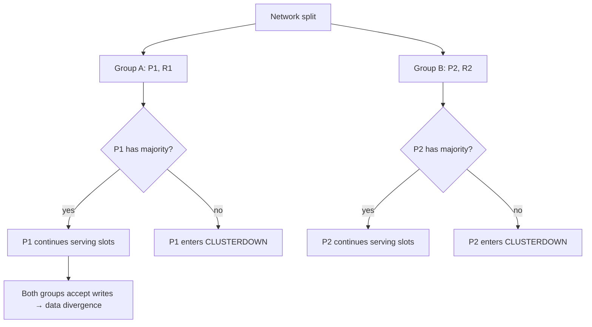

**How Valkey handles it**:

1. **ConfigEpoch collision resolution**: `clusterHandleConfigEpochCollision()` — node with higher configEpoch wins. The losing node bumps its epoch.

2. **Quorum-based failover**: A replica needs majority of primaries to vote before it can promote. In a minority partition, failover cannot proceed.

3. **`cluster-require-full-coverage`**: If enabled, any uncovered slot → `CLUSTERDOWN` for all requests.

**Limitation**: If both partitions have a majority (impossible with odd primaries, but possible with even), both can accept writes → **data divergence on partition heal**.

### 13.2 Mass Primary Failure

**Scenario**: Multiple primaries fail simultaneously.

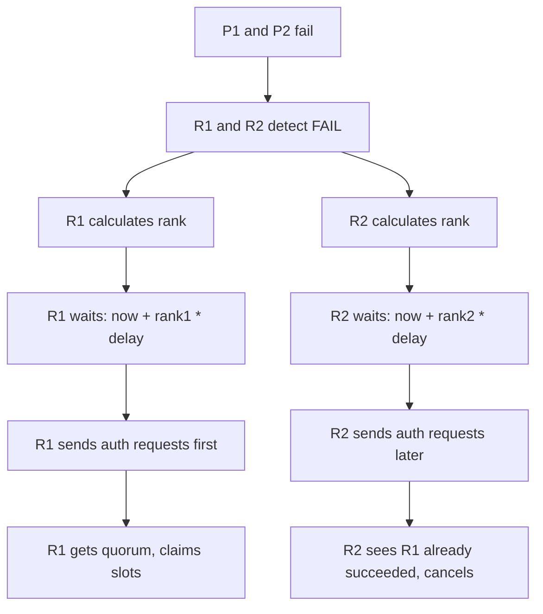

**Built-in protections**:
- `clusterGetFailedPrimaryRank()` adds delay based on `shard_id` ordering
- `cluster-replica-validity-factor` limits how old a failure report can be
- Replicas with higher replication offset go first

### 13.3 Slot Coverage Gap

**Scenario**: A slot is unassigned (no primary owns it).

```
cluster-require-full-coverage yes  → CLUSTERDOWN for ALL requests
cluster-require-full-coverage no   → requests to uncovered slot → CLUSTERDOWN Hash slot not served
                                     requests to covered slots   → served normally
```

**Common causes**:
- Node removed without reassigning its slots
- Failed node with no replicas
- Incomplete resharding operation

### 13.4 Orphaned Primary (Lost All Slots)

**Scenario**: A primary migrates away all its slots and has no slots left.

**Behavior** (with `cluster-allow-replica-migration yes`):
- The empty primary automatically becomes a replica of the new slot owner
- One of its own replicas may migrate to another primary

**Behavior** (with `cluster-allow-replica-migration no`):
- The primary stays as an **empty primary** — logs a warning
- It has no slots, so it serves no data
- It can accept manual slot assignments later

### 13.5 Replica Migration Race

**Scenario**: Primary A has 2 replicas. One replica migrates to Primary B. Meanwhile, Primary A's remaining replica triggers failover.

```mermaid
sequenceDiagram
    participant RA1 as Replica A1
    participant PA as Primary A
    participant RA2 as Replica A2
    participant PB as Primary B

    Note over RA2: Decides to migrate (A has >1 replica)
    RA2->>PB: MIGRATE — becomes replica of B
    Note over RA1: Detects PA in FAIL state
    RA1->>RA1: Calculate rank, send auth requests
    RA1->>RA1: Claims PA's slots
    Note over PA: Now has 0 replicas
    Note over RA1: Failover succeeds
    Note over RA2: Now replica of B, unaffected
```

**Conditions**:
- `cluster-allow-replica-migration yes`
- `cluster-migration-barrier`: minimum replicas that must remain on source (default: 1)
- `CLUSTER_REPLICA_MIGRATION_DELAY`: 5000ms wait before migrating

### 13.6 Gossip Message Flooding

**Scenario**: A large cluster with many nodes generates excessive gossip traffic.

**Behavior**:
- `clusterCron` runs 10x/second
- Each iteration pings the node with the oldest pong (from a sample of 5)
- PING messages contain gossip sections with random nodes' status
- Message size is limited by `CLUSTERMSG_MAX_SIZE` (typically 6144 bytes)

**Risk**: In very large clusters (>1000 nodes), gossip propagation slows down. Failure detection latency increases linearly with cluster size.

### 13.7 Config Epoch Collision

**Scenario**: Two nodes independently bump their configEpoch and claim the same slots.

**Resolution**:
- `clusterBumpConfigEpochWithoutConsensus()` assigns a new epoch
- Nodes exchange config and resolve: higher epoch wins
- Losing node gives up the slots

**When it happens**:
- After slot migration completion
- During failover
- After network partition heals

### 13.8 Cluster Configuration Corruption

**Scenario**: `nodes.conf` is corrupted or manually edited incorrectly.

**Symptoms**:
- Node refuses to start or joins with wrong topology
- Duplicate node IDs
- Incorrect slot assignments
- Epoch rollback (epoch decreased)

**Recovery**:
- Stop all nodes
- Fix or regenerate `nodes.conf`
- Use `CLUSTER MEET` to rebuild topology
- Last resort: `CLUSTER RESET` and rebuild from scratch

### 13.9 Multi-Key Command During Migration

**Scenario**: `MGET key1 key2` where `key1` is on source (slot migrating) and `key2` is already on destination.

```mermaid
flowchart TD
    A[Client sends MGET key1 key2<br/>to source node] --> B{Both keys on same slot?}
    B -->|no| C[Cross-slot error]
    B -->|yes| D{Slot is MIGRATING?}
    D -->|yes| E{All keys present locally?}
    E -->|no| F[-TRYAGAIN]
    E -->|yes| G[Return values]
    D -->|no| H[Normal processing]
```

### 13.10 Minority Partition — Writable Delay

**Scenario**: A primary loses quorum (minority partition), then regains it.

```mermaid
flowchart TD
    A[Primary loses majority] --> B[Enters CLUSTER_FAIL state]
    B --> C[Stops accepting writes]
    C --> D[Majority restored]
    D --> E[Wait CLUSTER_WRITABLE_DELAY = 2000ms]
    E --> F[Plus rejoin delay based on node timeout]
    F --> G[Accept writes again]
```

**Why the delay?** To allow cluster configuration updates to propagate before the node starts accepting writes again.

---

## 14. Operational Checklist

### Replication Health

| Check | Command | What to Look For |
|-------|---------|------------------|
| Replica status | `INFO replication` | `connected_slaves`, `repl_backlog_histlen`, `slave*_lag` |
| Replica lag | `INFO replication` per slave | `slave*_lag` should be low (< 1s) |
| Backlog health | `INFO replication` | `repl_backlog_size` vs `repl_backlog_histlen` |
| Replica memory | `INFO memory` → `client-output-buffer-memory` | Growing buffers indicate slow replicas |
| PSYNC failures | `INFO stats` → `sync_partial_err`, `sync_full` | High `sync_full` = backlog too small |
| Stale data serving | `CONFIG GET replica-serve-stale-data` | `yes` = replicas serve potentially outdated data |

### Cluster Health

| Check | Command | What to Look For |
|-------|---------|------------------|
| Cluster state | `CLUSTER INFO` → `cluster_state` | `ok` or `fail` |
| Slot coverage | `CLUSTER INFO` → `cluster_slots_assigned` | Should be 16384 |
| Known nodes | `CLUSTER INFO` → `cluster_known_nodes` | Expected count |
| Failed nodes | `CLUSTER NODES` → flags with `fail` | Any FAIL nodes? |
| PFAIL nodes | `CLUSTER NODES` → flags with `fail?` | Transient, but watch for persistence |
| Epoch consistency | `CLUSTER INFO` → `cluster_current_epoch` | Should be consistent across nodes |
| Replication links | `CLUSTER NODES` → replica counts | Each primary should have ≥ 1 replica |

### Critical Configuration Parameters

#### Replication

| Parameter | Default | Recommendation |
|-----------|---------|----------------|
| `repl-backlog-size` | 1MB | Increase to 64-256MB for production |
| `repl-backlog-time-limit` | 3600s | Keep default or increase |
| `repl-timeout` | 60s | Increase for high-latency networks |
| `repl-diskless-sync` | no | Enable for fast sync, but requires more network bandwidth |
| `repl-diskless-load` | disabled | `swapdb` for zero-downtime sync |
| `min-replicas-to-write` | 0 | Set to 1 for data safety |
| `min-replicas-max-lag` | 10s | Tune based on network RTT |
| `replica-serve-stale-data` | yes | Set to `no` if stale reads are unacceptable |
| `client-output-buffer-limit replica` | 256MB/64MB/60s | Increase if replicas are slow but must stay connected |

#### Cluster

| Parameter | Default | Recommendation |
|-----------|---------|----------------|
| `cluster-node-timeout` | 15000ms | 5000-10000ms for low-latency networks |
| `cluster-require-full-coverage` | yes | `no` if partial availability is acceptable |
| `cluster-allow-replica-migration` | yes | Keep enabled for automatic failover support |
| `cluster-migration-barrier` | 1 | Keep at 1 (at least 1 replica must remain) |
| `cluster-replica-validity-factor` | 10 | Controls max disqualification time for failover |
| `cluster-allow-reads-when-down` | no | `yes` for read-only availability during failure |

---

## Appendix: Key Constants

```c
// Cluster
#define CLUSTER_SLOTS              16384    // Total hash slots
#define CLUSTER_PORT_INCR          10000    // Cluster bus port offset
#define CLUSTERMSG_MAX_SIZE        6144     // Max gossip message size
#define CLUSTER_WRITABLE_DELAY     2000     // ms to wait before accepting writes after rejoin
#define CLUSTER_FAIL_REPORT_VALIDITY_MULT 2  // Failure report validity multiplier
#define CLUSTER_FAIL_UNDO_TIME_MULT     2  // Time before FAIL can be undone
#define CLUSTER_MF_PAUSE_MULT      2        // Manual failover pause multiplier
#define CLUSTER_REPLICA_MIGRATION_DELAY 5000 // ms before replica migration

// Replication
#define REPL_MAX_WRITTEN_BEFORE_FSYNC (1024*32) // fsync every 32KB during RDB write
#define REPL_BACKLOG_INDEX_PER_BLOCKS 16        // Index entry every N blocks
#define REPL_BACKLOG_TRIM_BLOCKS_PER_CALL 16    // Max blocks trimmed per call
```

## Appendix: Useful Commands

```bash
# Replication info
valkey-cli INFO replication
valkey-cli INFO stats | grep sync

# Cluster info
valkey-cli -c CLUSTER INFO
valkey-cli -c CLUSTER NODES
valkey-cli -c CLUSTER SLOTS
valkey-cli -c CLUSTER SHARDS

# Check slot for key
valkey-cli CLUSTER KEYSLOT "mykey"

# Trigger failover
valkey-cli -h <replica-host> -p <replica-port> CLUSTER FAILOVER

# Coordinated failover (standalone)
valkey-cli -h <replica-host> -p <replica-port> FAILOVER

# Check replication lag
valkey-cli -h <primary> INFO replication | grep lag

# Monitor replication stream
valkey-cli MONITOR  # WARNING: high overhead, use only for debugging
```
